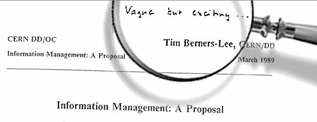

## The Web, aka World Wide Web, WWW
## "vague but exciting"
 
Quelle: [http://info.cern.ch/Proposal.html](http://info.cern.ch/Proposal.html)
	- ## Die Grundbausteine des WWW
	  * basiert ursprünglich auf [[URIs]], [[HTTP]], [[HTML]]
	  * mit der Zeit kamen dazu: [[CSS]], [[JavaScript]]
- Auf den Schultern des [Internet]([[Netzwerkprotokolle]])
  {:width 700}
  <small>Quelle: <a href="https://developer.mozilla.org/en-US/docs/Web/HTTP/Overview/http-layers.png">MDN</a>, Lizenz: <a href="https://creativecommons.org/licenses/by-sa/3.0/deed.locale">CC-BY-SA 3.0</a></small>