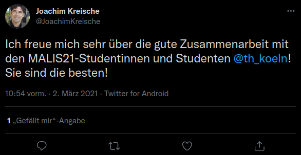

## HTML – Hypertext Markup Language
## *Hypertext* Markup Language
* Zu "Hypertext" siehe ((61652072-0b04-46a9-95b0-9c4ed57f9f78))
## Hypertext *Markup Language*
* deutsch: Auszeichnungssprache
## Browser als HTML-Spielplatz
id:: 61652072-e2cb-4ab8-abe4-78bd6194a7aa
* Jede im Webbrowser aufgerufene HTML-Seite lässt sich dort editieren
* Einfach `STRG+Umschalt+i), z.B.:
 
<small><a href="https://twitter.com/JoachimKreische/status/1366688403396440064">https://twitter.com/JoachimKreische/status/1366688403396440064</a>, editiert in Firefox</small>
## Übung
((6164a03d-1fba-472c-865c-e668bd6ab2f1))