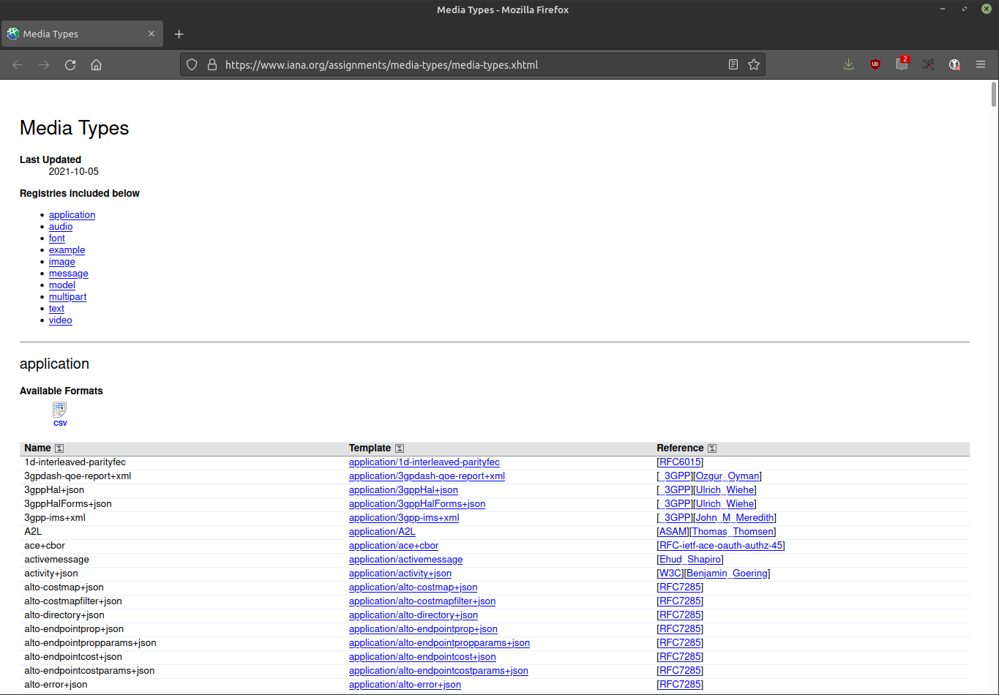

- ## HTTP – *Hyptertext* Transfer Protocol
  id:: 61652072-0b04-46a9-95b0-9c4ed57f9f78
  * Ausdruck wurde in den 1960ern von [Ted Nelson](https://de.wikipedia.org/wiki/Theodor_Holm_Nelson) geprägt
  * Grundidee: Schreiben/Denken und Publizieren in Form von Graphen, die sich mit Unterstützung von Maschinen auch leichte Weise beliebig anlegen und durchqueren lassen
  * Die Ideen dahinter gehen u.a. zurück auf "[As we may think](https://de.wikipedia.org/wiki/As_We_May_Think)" von Vannevar Bush
## Geschichte (Ultrakurzfassung)
* 1989 begann die Entwicklung durch Tim Berners-Lee gemeinsam mit URI/URL und HTML
* aktuelle Version: HTTP/2 (seit Mai 2015)
## HTTP-Kommunikation besteht aus
* 1. Anfrage (Request): Client erbittet eine Aktion des Servers
* 2. Antwort (Response): Server sendet Informationen und ggf.
angeforderte Daten zurück
## Eigenschaften von HTTP
* verbindungslos und zustandslos
* Unabhängig vom Medienformat
- {:width 800}
  id:: 61633c54-b22b-4398-93b6-0bfc75c0b472
  <small><a href="https://www.iana.org/assignments/media-types/media-types.xhtml">Liste der IANA Media Types</a></small>
## HTTP Request
{:height 384, :width 701}
- HTTP Response
  
- HTTP-Verbindungen beim Aufruf einer Webseite
  
- https://developer.mozilla.org/en-US/docs/Web/HTTP/Overview/client-server-chain.png{:height 112, :width 704}
  Bei einem HTTP-Request gibt es i. d. R. keine direkte Verbindung zwischen Client und Server, sondern viele Zwischenglieder (Proxies), die auf der Ebene des Webs irrelevant sind, sondern "nur" auf Ebene der transportorientieren [[Netzwerkprotokolle]] (z.B. TCP/IP) existieren.
- ## Status Codes – Übersicht
  id:: 61633c54-3046-4ff3-aff1-4125dbf13d9b
  1xx – Informationen
  2xx – Erfolgreiche Operation
  3xx – Umleitung
  4xx – Client-Fehler
  5xx – Server-Fehler
  9xx – Proprietäre Fehler
## Status Codes – Beispiele
200 OK
302 Found 
401 Unauthorized
404 Not Found
500 Internal Server Error
## HTTP-Methoden
id:: 615a1548-1998-41c0-b6fe-9e41393379b2
Insgesamt neun Stück, hier die wichtigsten:
GET
DELETE
POST
PUT
## Tools
* [curl](https://curl.se/): umfassendes Tool zum Übertragen von Dateien in Rechnernetzen und [eines der weltweit meistgenutzten Open-Source-Projekte](https://daniel.haxx.se/blog/2018/09/17/the-worlds-biggest-curl-installations/). Kann als Programmbibliothek, auf der Kommandozeile oder im Browser genutzt werden unter [https://reqbin.com/curl].
* [wget](https://de.wikipedia.org/wiki/Wget): ähnlich wie curl, kann allerdings nur `GET` requests.
## Request Header & curl
id:: 61645f8e-7f9f-4e08-95f0-45b0eca901f9
* Bei einem HTTP Request kann ich im Accept Header angeben, welchen Media Type ich präferiere und der Server wird mir die Ressource entsprechend ausliefern, wenn er den Media Type untertützt
* Request Header werden in curl mit der Option `-H` gesetzt, z.B: `$ curl -H "accept: {IANA Media Type}" "{url}"`
* Übung: ((870fc3ef-9689-42ad-9707-7c169c4b72e1))
## Response Header & curl
id:: 61646058-743c-4d05-8397-233e3cf36757
* Auch eine HTTP Response beinhaltet Header.
* Um die Response Header mit curl zusätzlich zur Antwort auszugeben, muss die Option `-i` gesetzt werden und `-I` wenn nur die Response Header angezeigt werden sollen.
## Beispiel: Response Header
id:: 616497d8-dece-4c69-9d71-811c80aee545
```
$ curl -I http://th-koeln.de
HTTP/1.0 302 Found
Location: https://th-koeln.de/
Server: BigIP
Connection: Keep-Alive
Content-Length: 0
```
## Übung
((6164943c-d95e-452e-8825-3afe059ced93))
## Umleitungen folgen mit curl
id:: 61649878-c8fe-4a4c-81a8-f910fe6760b7
* Wie [oben](((61633c54-3046-4ff3-aff1-4125dbf13d9b))) beschrieben, kann ein Server `3xx`-Codes zurückliefern mit einer Umleitung (Redirect) zu einer anderen Resource (meist `301 Moved Permanently` oder `302 Found` wie in ((616497d8-dece-4c69-9d71-811c80aee545))).
* Durch setzen der Option `-L` folgt curl solchen Redirects automatisch bis es nicht mehr weitergeht.
## Beispiel: Umleitungen folgen
```
$ curl -LI http://th-koeln.de
HTTP/1.0 302 Found
Location: https://th-koeln.de/
Server: BigIP
Connection: Keep-Alive
Content-Length: 0

HTTP/1.1 301 Moved Permanently
Date: Mon, 11 Oct 2021 20:11:59 GMT
Server: Apache
Location: https://www.th-koeln.de/
Connection: close
Content-Type: text/html; charset=iso-8859-1
Set-Cookie: BIGipServercms-public-live_prod_https=1594623627.47873.0000; path=/; Httponly; Secure

HTTP/1.1 200 OK
Date: Mon, 11 Oct 2021 20:12:03 GMT
Server: Apache
X-Powered-By: PHP/7.2.5
Set-Cookie: SimpleSAML=132d26b6460eb60fee530f15886d435a; path=/; HttpOnly
Expires: Thu, 19 Nov 1981 08:52:00 GMT
Cache-Control: no-cache, no-store, must-revalidate
Pragma: no-cache
X-UA-Compatible: IE=edge
Connection: close
Content-Type: text/html; charset=UTF-8
Set-Cookie: BIGipServercms-public-live_prod_https=1594623627.47873.0000; path=/; Httponly; Secure
```
## Übung
((61652072-893a-4914-92e8-7d9d5fcfd878))