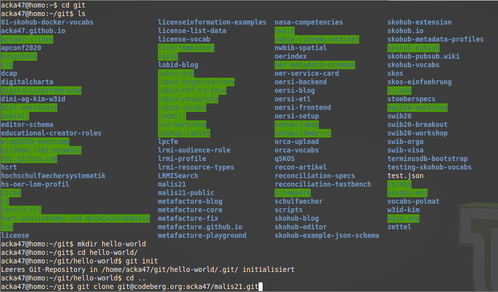

# Kennenlernen
title:: Kennenlernen
## Werdegang
* {:height 79, :width 50} https://orcid.org/0000-0001-9083-7442 
* Magister Kommunikationswissenschaft und Philosophie an der RWTH Aachen
* MALIS09-Absolvent ([Master Thesis](http://eprints.rclis.org/16175/))
* Seit 2008 im hbz
* Seit 2019-10 Leitung Offene Infrastruktur
* Co-Chair des [SWIB](https://swib.org)-Programmkomitees
* Moderation [OER-Metadatengruppe DINI AG KIM](https://wiki.dnb.de/display/DINIAGKIM/OER-Metadatengruppe)
## Mein Team
* Offene Infrastruktur (bald: Dateinfrastruktur)
* derzeit: zwei Bibliothekare, drei Entwickler\*innen
## Erfahrungen und Fähigkeiten
* Projekt-/Produktmanagement
* Datenmodellierung & Standards
* Funktionales Review
* kann keinen (guten) Softwarecode schreiben, ist aber integraler Bestandteil der Softwareentwicklung
* Artikel, Blogposts (z.B. [hier](https://blog.lobid.org/)), Workshops & Präsentationen (siehe [Slides](https://slides.lobid.org/))
## Und Sie?
* Moodle-Profile habe ich mir angeschaut
* Wir verzichten auf eine Vorstellungsrunde
* Stattdessen eine kleine Umfrage
## Wie häufig benutzen Sie einen Webbrowser?
## Markdown?
## Sonstige Erfahrungen mit Web-Technologien?
## Ein Auge für Daten?
## Kommandozeile?

## Schonmal einen git commit gemacht?
`$ git commit -am "Ergänze Folie 127"`