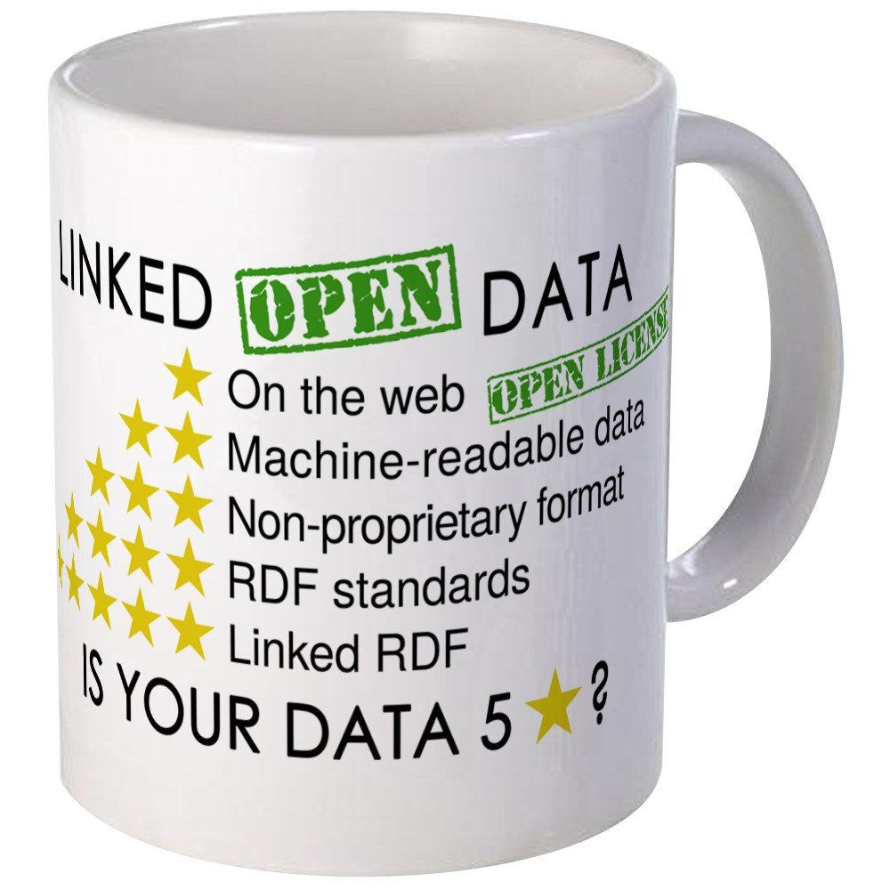
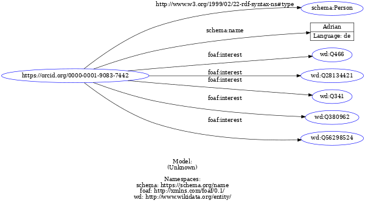
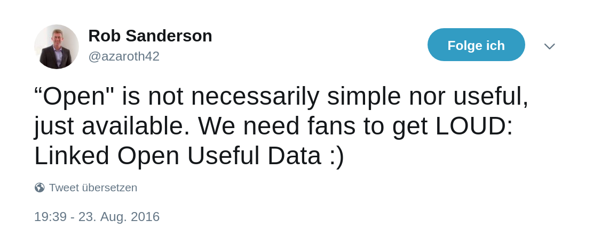

- ## Aufgabe: ((61c341e4-ccd1-4a33-93b9-8c62e281a470))
- ## Warum LOD?
  * Überführung traditioneller bibl. Praktiken in das Web
  * Sichtbarkeit und Auffindbarkeit im Web erreichen
  * Nachnutzbarkeit ermöglichen
  * Synergieeffekte durch Verlinkung mit anderen Daten
  * Verbesserung der Recherchemöglichkeiten
  Pohl, Adrian / Ostrowski, Felix (2010): 'Linked Data' - und warum wir uns im hbz-Verbund damit beschäftigen." B.I.T. Online 13(3): S. 259-268. [Preprint (PDF)](https://hbz.opus.hbz-nrw.de/files/269/PDFA_Linked_Data_Pohl_Ostrowski_2010.pdf)
- ## Open Definition
  > Wissen ist offen, wenn jedeR darauf frei zugreifen, es nutzen, verändern und teilen kann – eingeschränkt höchstens durch Maßnahmen, die Ursprung und Offenheit des Wissens bewahren. 
  
  [https://opendefinition.org/od/2.1/de/](https://opendefinition.org/od/2.1/de/)
- ## Linked Data: Best Practices
  1. Nutze URIs als Namen für Dinge
  2. Nutze HTTP-URIs, so dass Menschen sie aufrufen können
  3. Wenn jemand einen URI aufruft, biete nützliche Informationen an unter Nutzung der Standards (RDF*, SPARQL)
  4. Nimm Links zu anderen URIs auf, so dass weitere Dinge entdeckt werden können.
  
  [Tim Berners-Lee (2006ff): Linked Data – Design Issues](https://www.w3.org/DesignIssues/LinkedData.html)
- 
  [https://5stardata.info](https://5stardata.info)
- ## Resource Description Framework (RDF)
  * SKOS wird in dem graph-basierten Datenmodell RDF kodiert
  * zum Austausch von Daten über das Web, entworfen und gepflegt vom W3C
  * Abstraktes Modell mit verschiedenen Serialisierungsformaten (RDF/XML, Turtle, JSON-LD…)
- ## Tripel überall
  Alle Daten in RDF existieren in Form von Tripeln mit Subjekt, Prädikat, Objekt:
  
- ## Abbildung von Daten in RDF **
  * **Subjekt**: Ressource über die eine Aussage getroffen wird
  * **Prädikat**: Beziehung zwischen Subjekt und Objekt
  * **Objekt**: Ressource, zu dem die Ressource in einer Verbindung steht oder ein Literal
- ## URIs und Literale
  * **Subjekt** und **Prädikat** sind immer ein URI
  * **Objekt** ist ein URI *oder* ein Literal (String, Date, Integer)
- | Subjekt | Prädikat| Objekt |
  | -------- | -------- | -------- |
  | Ich     | heiße     | Adrian.     |
  | `<https://orcid.org/0000-0001-9083-7442>` | `<https://schema.org/name>`  | `"Adrian"@de` . |
  | Ich | interessiere mich  für | Linked Library Data. |
  | `<http://example.org/myDog>` | `<http://xmlns.com/foaf/0.1/interest>`  | `<http://www.wikidata.org/entity/Q28134421>` . |
- ## Die verschiedenen RDF-Serialisierungen sind semantisch äquivalent
- ## N-Triples
  ```
  <https://orcid.org/0000-0001-9083-7442> <http://www.w3.org/1999/02/22-rdf-syntax-ns#type> <https://schema.org/namePerson> .
  <https://orcid.org/0000-0001-9083-7442> <https://schema.org/namename> "Adrian"@de .
  <https://orcid.org/0000-0001-9083-7442> <http://xmlns.com/foaf/0.1/interest> <http://www.wikidata.org/entity/Q466> .
  <https://orcid.org/0000-0001-9083-7442> <http://xmlns.com/foaf/0.1/interest> <http://www.wikidata.org/entity/Q28134421> .
  <https://orcid.org/0000-0001-9083-7442> <http://xmlns.com/foaf/0.1/interest> <http://www.wikidata.org/entity/Q341> .
  <https://orcid.org/0000-0001-9083-7442> <http://xmlns.com/foaf/0.1/interest> <http://www.wikidata.org/entity/Q380962> .
  <https://orcid.org/0000-0001-9083-7442> <http://xmlns.com/foaf/0.1/interest> <http://www.wikidata.org/entity/Q56298524> .
  ```
- ## Turtle
  id:: 61c43449-1c21-4bf9-8e5f-e7f3eacfb896
  ```turtle
  @prefix schema: <https://schema.org/name> .
  @prefix foaf: <http://xmlns.com/foaf/0.1/> .
  @prefix wd: <http://www.wikidata.org/entity/> .
  - <https://orcid.org/0000-0001-9083-7442> a schema:Person ;
    schema:name "Adrian"@de ;
    foaf:interest wd:Q466, wd:Q28134421, wd:Q341, wd:Q380962 , wd:Q56298524 .
  ```
- ## RDF/XML
  ```xml
  <?xml version="1.0" encoding="utf-8"?>
  <rdf:RDF xmlns:foaf="http://xmlns.com/foaf/0.1/"
     xmlns:rdf="http://www.w3.org/1999/02/22-rdf-syntax-ns#"
     xmlns:schema="https://schema.org/name">
    <schema:Person rdf:about="https://orcid.org/0000-0001-9083-7442">
      <foaf:interest rdf:resource="http://www.wikidata.org/entity/Q28134421"/>
      <foaf:interest rdf:resource="http://www.wikidata.org/entity/Q341"/>
      <foaf:interest rdf:resource="http://www.wikidata.org/entity/Q380962"/>
      <foaf:interest rdf:resource="http://www.wikidata.org/entity/Q466"/>
      <foaf:interest rdf:resource="http://www.wikidata.org/entity/Q56298524"/>
      <schema:name xml:lang="de">Adrian</schema:name>
    </schema:Person>
  </rdf:RDF>
  ```
- ## RDFa
- ## JSON-LD
  ```json
  {
      "@context": {
          "Person": "https://schema.org/Person",
          "name": "https://schema.org/name",
          "interest": "http://xmlns.com/foaf/0.1/interest"
      },
      "@id": "https://orcid.org/0000-0001-9083-7442",
      "@type": "Person",
      "name": "Adrian",
      "interest": [
          "http://www.wikidata.org/entity/Q466",
          "http://www.wikidata.org/entity/Q28134421",
          "http://www.wikidata.org/entity/Q341",
          "http://www.wikidata.org/entity/Q380962",
          "http://www.wikidata.org/entity/Q56298524"
      ]
  }
  ```
- ## RDF-Visualisierung 
  
- ## Übung: Turtle schreiben
  Erstellen Sie eine kurze Beschreibung von sich orientiert am Beispiel von ((61c43449-1c21-4bf9-8e5f-e7f3eacfb896)).
  Zur Erstellung und Validierung lässt sich gut dieser Turtle-Web-Editor nutzen: https://felixlohmeier.github.io/turtle-web-editor/
- ## SPARQL
  * SPARQL Protocol and RDF Query Language
  * Sprache/Protokoll zur Abfrage von RDF-Graphen 
  * [https://w.wiki/4da8](https://w.wiki/4daU)
- ## Ein Imageproblem?
   > Ultimately, RDF and the Semantic Web are of no interest to Web developers. They also have a really negative public perception problem. We should stop talking about them. Let’s shift the focus to be on Linked Data, explaining the problems that Web developers face today, and concrete, demonstrable solutions to those problems.
  
  – Manu Sporny, damals Vorsitzender der RDFa Working Group beim W3C, der JSON-LD Community Group & Mitglied weiterer Semantic-Web-Gruppen, beim Schreiben an der JSON-LD-Spezifikation [Sporny (2012)](http://manu.sporny.org/2012/nuclear-rdf/)
- ## Linked Open Usable Data
  
  Quelle: [Rob Sanderson auf Twitter](https://twitter.com/azaroth42/status/768140561794502656), siehe auch Rob Sanderson's Europeanatech 2018 Keynote ([Slides](https://de.slideshare.net/azaroth42/europeanatech-keynote-shout-it-out-loud), [Aufzeichnung](https://www.youtube.com/watch?v=r4afi8mGVAY))
- ## Using *data*?
  * Daten werden mit existierender Software bearbeitet (ausgewertet, ergänzt, integriert etc.)
  * Entwicklung neuer Software zur Interaktion mit Daten
  * LOUD: Orientierung auf Bedürfnisse und Konventionen rund um Software (Entwicklung, Standards, etc.)
  * Nützliche Daten: Zielgruppe kennen & eigene Angebote auf sie ausrichten
  * Hauptzielgruppe: Entwickler:innen oder Nutzer:innen von Software für Datenzugriff und -manipulation
- ## LOUD = Web-APIs mit JSON-LD
  * Entwickler:innen sind Kernzielgruppe von Open-Data-Publikation
  * APIs sind das User Interface von Entwickler:innen
  > When it comes to APIs, developers are your users. The same principles of user-centred-design apply to the development and publication of APIs (simplicity, obviousness, fit-for-purpose etc).
  
  Quelle: https://apiguide.readthedocs.io/en/latest/principles/empathy.html
- ## JSON-LD
  * "designed to be usable directly as JSON, with no knowledge of RDF" – Es ist richtiges JSON!
  * "also designed to be usable as RDF"
  https://www.w3.org/TR/json-ld/
- ## Warum nicht einfach JSON?
  *Usable* heisst nicht nur dass die Daten strukturell gut nutzbar sind, sondern auch einige Vorteile von Linked Data mit sich bringen:
  1. Implizite Dokumentation: Properties haben URIs und ihre Bedeutung lässt sich nachschlagen
  2. Interoperabilität: wer nicht nachnutzt, muss selbst spezifizieren -> Anreiz zur Nachnutzung gemeinsamer Datenmodelle
  3. Things not strings: Präferenz von URIs über Strings führt zu Erstellung, Nutzung und Pflege von SKOS-Schemas für kontrollierte Wertelisten, für die wiederum 1.) & 2.) gelten
- ## LOUD-Beispiele
  * [lobid](https:/lobid.org) 
  * [IIIF](https://iiif.io/)
  * [Linked Art](https://linked.art/)
  * [OERSI](https://oersi.de) und [AMB](https://w3id.org/kim/amb/)