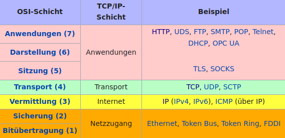

### Protokoll: "Festlegung von Standards und Konventionen für eine reibungslose Datenübertragung zwischen Computern"
([Duden](https://www.duden.de/rechtschreibung/Protokoll))
## Netzwerkprotokolle
* stellen den sicheren, fehlerfreien & zuverlässigen Austausch von Daten zwischen Rechnern sicher
* regeln die Prozesse des lesenden & schreibenden Zugriffs von einen Rechner auf einen anderen
## OSI-Referenzmodell 
* an der Datenübertragung in einem Computernetzwerk sind immer verschiedene Protokollschichten beteiligt
* z.B. setzen SMTP wie auch HTTP auf TCP/IP auf
* das OSI-Modell ist "ein Referenzmodell für Netzwerkprotokolle als Schichtenarchitektur" ([Wikipedia](https://de.wikipedia.org/w/index.php?title=OSI-Modell&oldid=215572834))
- 
  <small>Quelle: Wikipedia-Seite <a href="https://de.wikipedia.org/wiki/Internetprotokollfamilie">"Internetprotokollfamilie"</a></small>
## Und DNS (Domain Name System)?
* Übersetzung von Domain-Namen (z.B. `lobid.org`) in IP-Adresse (`193.30.112.187`).
* Angesiedelt auf der Anwendungsebene des Internet, Übergang zur Vermittlungsebene (IP)
### [[HTTP]] ist das Transportprotokoll des Web auf der Anwendungsschicht des Internet.
- {:width 700}
  Der [Vater des Web](https://de.wikipedia.org/wiki/Tim_Berners-Lee) und [einer der Elternteile des Internet](https://de.wikipedia.org/wiki/Vinton_G._Cerf), ©W3C ([Quelle](https://www.w3.org/20/img/event/0O4A8746_large.jpg))