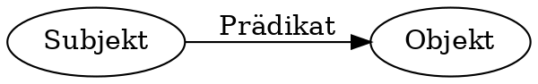

- ## Resource Description Framework (RDF)
  * SKOS wird in dem graph-basierten Datenmodell RDF kodiert
  * zum Austausch von Daten über das Web, entworfen und gepflegt vom W3C
  * Abstraktes Modell mit verschiedenen Serialisierungsformaten (RDF/XML, Turtle, JSON-LD…)
- ## Tripel überall
  Alle Daten in RDF existieren in Form von Tripeln mit Subjekt, Prädikat, Objekt:
  
- ## Abbildung von Daten in RDF
  * **Subjekt**: Ressource über die eine Aussage getroffen wird
  * **Prädikat**: Beziehung zwischen Subjekt und Objekt
  * **Objekt**: Ressource, zu dem die Ressource in einer Verbindung steht oder ein Literal
- ## URIs und Literale
  * **Subjekt** und **Prädikat** sind immer ein URI
  * **Objekt** ist ein URI *oder* ein Literal (String, Date, Integer)
- | Subjekt | Prädikat| Objekt |
  | -------- | -------- | -------- |
  | Ich     | heiße     | Adrian.     |
  | `<https://orcid.org/0000-0001-9083-7442>` | `<https://schema.org/name>`  | `"Adrian"@de` . |
  | Ich | interessiere mich  für | Linked Library Data. |
  | `<http://example.org/myDog>` | `<http://xmlns.com/foaf/0.1/interest>`  | `<http://www.wikidata.org/entity/Q28134421>` . |
- ## Die verschiedenen RDF-Serialisierungen sind semantisch äquivalent
- ## N-Triples
  ```
  <https://orcid.org/0000-0001-9083-7442> <http://www.w3.org/1999/02/22-rdf-syntax-ns#type> <https://schema.org/namePerson> .
  <https://orcid.org/0000-0001-9083-7442> <https://schema.org/namename> "Adrian"@de .
  <https://orcid.org/0000-0001-9083-7442> <http://xmlns.com/foaf/0.1/interest> <http://www.wikidata.org/entity/Q466> .
  <https://orcid.org/0000-0001-9083-7442> <http://xmlns.com/foaf/0.1/interest> <http://www.wikidata.org/entity/Q28134421> .
  <https://orcid.org/0000-0001-9083-7442> <http://xmlns.com/foaf/0.1/interest> <http://www.wikidata.org/entity/Q341> .
  <https://orcid.org/0000-0001-9083-7442> <http://xmlns.com/foaf/0.1/interest> <http://www.wikidata.org/entity/Q380962> .
  <https://orcid.org/0000-0001-9083-7442> <http://xmlns.com/foaf/0.1/interest> <http://www.wikidata.org/entity/Q56298524> .
  ```
- ## Turtle
  id:: 5d658352-ea66-4ccc-91ce-a48d2a80294b
  ```turtle
  @prefix schema: <https://schema.org/name> .
  @prefix foaf: <http://xmlns.com/foaf/0.1/> .
  @prefix wd: <http://www.wikidata.org/entity/> .
  - <https://orcid.org/0000-0001-9083-7442> a schema:Person ;
    schema:name "Adrian"@de ;
    foaf:interest wd:Q466, wd:Q28134421, wd:Q341, wd:Q380962 , wd:Q56298524 .
  ```
- ## RDF/XML
  ```xml
  <?xml version="1.0" encoding="utf-8"?>
  <rdf:RDF xmlns:foaf="http://xmlns.com/foaf/0.1/"
     xmlns:rdf="http://www.w3.org/1999/02/22-rdf-syntax-ns#"
     xmlns:schema="https://schema.org/name">
    <schema:Person rdf:about="https://orcid.org/0000-0001-9083-7442">
      <foaf:interest rdf:resource="http://www.wikidata.org/entity/Q28134421"/>
      <foaf:interest rdf:resource="http://www.wikidata.org/entity/Q341"/>
      <foaf:interest rdf:resource="http://www.wikidata.org/entity/Q380962"/>
      <foaf:interest rdf:resource="http://www.wikidata.org/entity/Q466"/>
      <foaf:interest rdf:resource="http://www.wikidata.org/entity/Q56298524"/>
      <schema:name xml:lang="de">Adrian</schema:name>
    </schema:Person>
  </rdf:RDF>
  ```
- ## RDFa
  id:: 61d559ac-7634-4d41-be44-9211f47ef1b7
- ## JSON-LD
  ```json
  {
      "@context": {
          "Person": "https://schema.org/Person",
          "name": "https://schema.org/name",
          "interest": "http://xmlns.com/foaf/0.1/interest"
      },
      "@id": "https://orcid.org/0000-0001-9083-7442",
      "@type": "Person",
      "name": "Adrian",
      "interest": [
          "http://www.wikidata.org/entity/Q466",
          "http://www.wikidata.org/entity/Q28134421",
          "http://www.wikidata.org/entity/Q341",
          "http://www.wikidata.org/entity/Q380962",
          "http://www.wikidata.org/entity/Q56298524"
      ]
  }
  ```
- ## RDF-Visualisierung 
  
- ## Übung: Turtle schreiben
  Erstellen Sie eine kurze Beschreibung von sich orientiert am Beispiel von ((5d658352-ea66-4ccc-91ce-a48d2a80294b)).
  Zur Erstellung und Validierung lässt sich gut dieser Turtle-Web-Editor nutzen: https://felixlohmeier.github.io/turtle-web-editor/