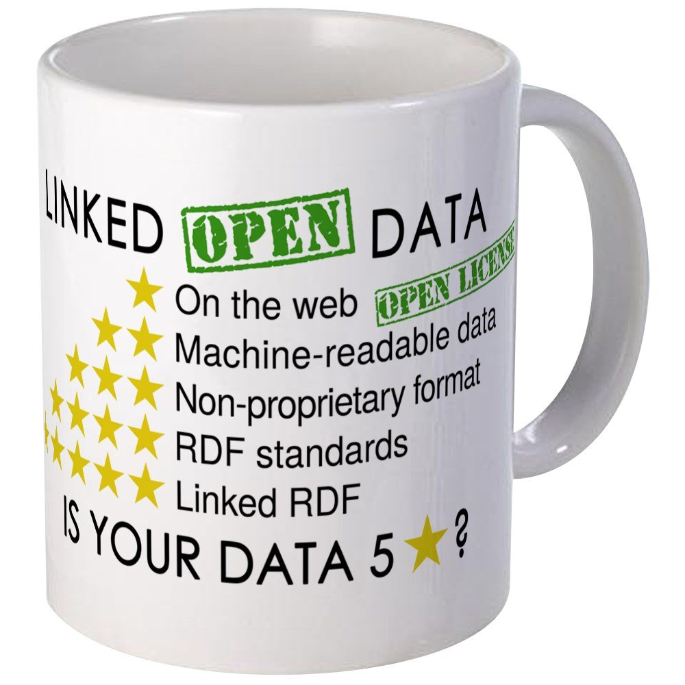
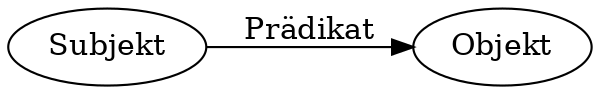

- ## Aufgabe: ((61c341e4-ccd1-4a33-93b9-8c62e281a470))
- ## Warum LOD?
  * Überführung traditioneller bibl. Praktiken in das Web
  * Sichtbarkeit und Auffindbarkeit im Web erreichen
  * Nachnutzbarkeit ermöglichen
  * Synergieeffekte durch Verlinkung mit anderen Daten
  * Verbesserung der Recherchemöglichkeiten
  Pohl, Adrian / Ostrowski, Felix (2010): 'Linked Data' - und warum wir uns im hbz-Verbund damit beschäftigen." B.I.T. Online 13(3): S. 259-268. [Preprint (PDF)](https://hbz.opus.hbz-nrw.de/files/269/PDFA_Linked_Data_Pohl_Ostrowski_2010.pdf)
- ## Open Definition
  > Wissen ist offen, wenn jedeR darauf frei zugreifen, es nutzen, verändern und teilen kann – eingeschränkt höchstens durch Maßnahmen, die Ursprung und Offenheit des Wissens bewahren. 
  
  [https://opendefinition.org/od/2.1/de/](https://opendefinition.org/od/2.1/de/)
- ## Linked Data: Best Practices
  1. Nutze URIs als Namen für Dinge
  2. Nutze HTTP-URIs, so dass Menschen sie aufrufen können
  3. Wenn jemand einen URI aufruft, biete nützliche Informationen an unter Nutzung der Standards (RDF*, SPARQL)
  4. Nimm Links zu anderen URIs auf, so dass weitere Dinge entdeckt werden können.
  
  [Tim Berners-Lee (2006ff): Linked Data – Design Issues](https://www.w3.org/DesignIssues/LinkedData.html)
- 
  [https://5stardata.info](https://5stardata.info)
- ## Resource Description Framework (RDF)
  * SKOS wird in dem graph-basierten Datenmodell RDF kodiert
  * zum Austausch von Daten über das Web, entworfen und gepflegt vom W3C
  * Abstraktes Modell mit verschiedenen Serialisierungsformaten (RDF/XML, Turtle, JSON-LD…)
- ## Tripel überall
  Alle Daten in RDF existieren in Form von Tripeln mit Subjekt, Prädikat, Objekt:
  
- ## Abbildung von Daten in RDF **
  * **Subjekt**: Ressource über die eine Aussage getroffen wird
  * **Prädikat**: Beziehung zwischen Subjekt und Objekt
  * **Objekt**: Ressource, zu dem die Ressource in einer Verbindung steht oder ein Literal
- ## URIs und Literale
  * **Subjekt** und **Prädikat** sind immer ein URI
  * **Objekt** ist ein URI *oder* ein Literal (String, Date, Integer)
- | Subjekt | Prädikat| Objekt |
  | -------- | -------- | -------- |
  | Mein Hund     | heißt     | Lica.     |
  | `<http://example.org/myDog>` | `<https://schema.org/name>`  | `"Lica"@de` . |
  | Mein Hund | interessiert sich  für | Apportieren. |
  | `<http://example.org/myDog>` | `<http://xmlns.com/foaf/0.1/interest>`  | `<http://www.wikidata.org/entity/Q621694>` . |