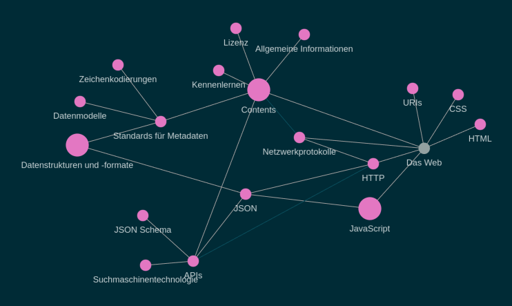

## Überblick als Baum
siehe "Inhalt" oder https://malis21.acka47.net/
## Überblick als Graph
siehe https://malis21.acka47.net/#/graph
- 
## Graph
"eine abstrakte Struktur, die eine Menge von Objekten zusammen mit den zwischen diesen Objekten bestehenden Verbindungen repräsentiert." ([Wikipedia](https://de.wikipedia.org/wiki/Graph_(Graphentheorie)))
Die Punkte heißen "Knoten" und die Verbindungen "Kanten".
## Kurze Zwischenfrage: Haben Sie Lust auf diese Themen?