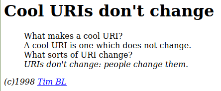

## *Uniform* Resource Identifier
id:: 6163df71-544f-4e45-908c-80ba1432a40f
Einheitlichkeit durch Standardisierung ([RFC 3986](https://datatracker.ietf.org/doc/html/rfc3986))
```
       foo://example.com:8042/over/there?name=ferret#nose
       \_/   \______________/\_________/ \_________/ \__/
        |           |            |            |        |
     scheme     authority       path        query   fragment
        |   _____________________|__
       / \ /                        \
       urn:example:animal:ferret:nose
```
## Uniform *Resource* Identifier
* Ressource = jedes mögliche Ding
* Dinge, die über das Internet abgerufen werden können (Informationsressourcen) oder nicht-digitale Ressourcen (gedruckte Bücher, Personen, Gebäude, abstrakte Entitäten wie z.B. Organisationen oder ein Metadatenattribut)
## Uniform Resource *Identifier*
* identifizieren: etwas von allem anderen unterscheiden, indem wir eindeutig Bezug darauf nehmen
* Identifikation ist mit ID-Vergabe nur unter besonderen Bedingungen erreicht, sondern ist eng an die Angabe von unterscheidenden Merkmalen gekoppelt, (z.B. Name, Geburts-/Herstellungsdatum)
## Beispiele
[`http://lobid.org/resources/HT020657906#!`](http://lobid.org/resources/HT020657906#!)
`urn:nbn:de:hbz:6:2-1426138`
`doi:10.3278/6004804w`
`https://dx.doi.org/10.3278/6004804w`
## Weitere Beispiele
`mailto:hans.dampf@example.org`
`ftp://public.ftp-servers.example.com/mydirectory/myfile.txt`
`git@codeberg.org:acka47/malis21.git`
Siehe auch [IANA – Liste der URI Schemes](http://www.iana.org/assignments/uri-schemes/uri-schemes.xhtml)
- 
  Quelle: https://www.w3.org/Provider/Style/URI.html
## Eine der wichtigsten Regeln
Wenn wir URIs einführen und nutzen, sollten wir uns Gedanken machen, wie wir ihre Beständigkeit und – bei HTTP-URIs – ihre langfristige Auflösbarkeit im Webbrowser sicherstellen können.