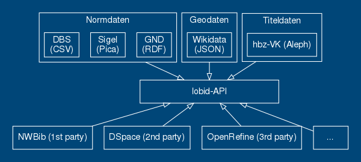
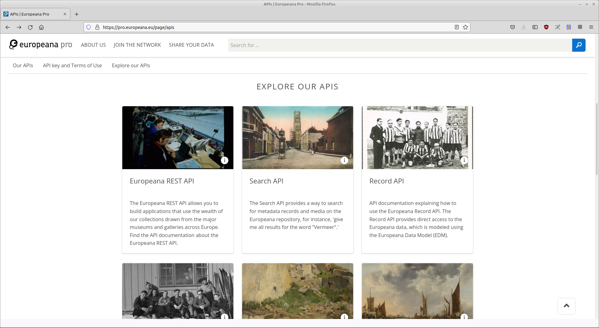

## Bibliotheken sind Software
> Our collections and services are delivered primarily via software. [...] The choices we make in the development, selection, and implementation of this software [...] define the limits of our content and services. We can only be as good as our software.
— Cody Hanson, [Libraries are Software](http://codyhanson.com/writing/software.html)
# APIs
title:: Web-APIs: Einführung
Application Programming Interface;
deutsch: Programmierschnittstellen
#### "ein Programmteil, der von einem Softwaresystem anderen Programmen zur Anbindung an das System zur Verfügung gestellt wird"
([Wikipedia](https://de.wikipedia.org/w/index.php?title=Programmierschnittstelle&oldid=215955723))
-
  * Software baut auf APIs auf
  * APIs machen Softwareentwicklung handhabbar
  * APIs ermöglichen Nutzung und Integration
  * APIs entkoppeln Anwendungen von Datenquellen, Formaten und Systemen
  * Sie ermöglichen modulare, zukunftsfähige Anwendungen
## Zum Beispiel lobid-Formate und -Anwendungen

## Und wie APIs im Web bereitstellen? 
* heutzutage meist [[JSON]] über [[HTTP]] 
* können anwendungsspezifisch sein (vgl. [lobid](https://lobid.org))
* oder auf geteilten Standards beruhen (z.B. [IIIF](https://iiif.io/), [DAIA-API](https://verbundwiki.gbv.de/display/VZG/DAIA))
- Bloße Lese-APIs (lassen sich gut mit [[Suchmaschinentechnologie]] umsetzen)
  vs.
  vollständige Unterstützung von CRUD-Operationen: Create, Read, Update, Delete
## Rückblick: URIs
```
foo://example.com:8042/over/there?name=ferret#nose
\_/   \______________/\_________/ \_________/ \__/
 |           |            |            |        |
scheme    authority      path        query   fragment
 |   _____________________|__
/ \ /                        \
urn:example:animal:ferret:nose
```
((6163df71-544f-4e45-908c-80ba1432a40f))
## Basis von Web-APIs: URIs & HTTP
* Path: Welche API-Endpoints gibt es?
* Parameter: z.B. `q` oder `search` für Suchabfragen oder `from`/`page` und `size` für Paging und Anzahl der Suchergebnisse
## HTTP-Methoden & ihre Funktionen
Create: POST (manchmal PUT)
Read: GET
Update: PUT (komplette Ressource), PATCH (teilweises Update), POST
Delete: DELETE
## JSON
[[JavaScript]] Object Notation
## JSON
* Ein einfaches Key-Value-Format für die Speicherung und den Austausch strukturierter Daten
* Key ist immer ein String
* Value ist String, Boolean, Array oder Object
* `{ "foo": "bar" }`
* Quelle: [RFC 8259](https://tools.ietf.org/html/rfc8259)
-
## Ein JSON-Dokument
```json
{
  "degreeProgramme": "MALIS",
  "module": "IT2",
  "topics": [
    "LZV",
    "Web APIs",
    "Linked Open Data"
  ],
  "instructor": [
    {
      "id": 8,
      "name": "Adrian Pohl",
      "affiliation": "hbz"
    },
    {
      "id": 15,
      "name": "Claudia Piesche",
      "affiliation": "USB Köln"
    }
  ]
}
```
## Das gleiche Dokument
```json
{"degreeProgramme":"MALIS","module":"IT2","topics":["LZV","Web APIs","Linked Open Data"],"instructor":[{"id":8,"name":"Adrian Pohl","affiliation":"hbz"},{"id":15,"name":"Claudia Piesche","affiliation":"USB Köln"}]}
```
Einrückungen und Zeilenumbrüche sind nur zur besseren Lesbarkeit durch Menschen und werden beim Lesen durch Maschinen weggekürzt.
## De-facto Standard für Daten im Web
* JSON über [[HTTP]] ist  seit langem *der* Standard für Web APIs, mit dem jede:r Entwickler:in vertraut ist 
* SIehe z.B. Target, Sinclair (2017): The Rise and Rise of JSON. URL: https://twobithistory.org/2017/09/21/the-rise-and-rise-of-json.html
## Übung: JSON-Fehler erkennen
## Fehler 1
```json
{
  "Hello": "World"
```
## Fehler 2
```json
{
  "degreeProgramme": "MALIS21"
  "module": "IT2"
}
```
## Fehler 3
```json
{
  "degreeProgramme": "MALIS21",
  "module: "IT2"
}
```
## Fehler 4
```json
{
  "degreeProgramme": "MALIS21",
  "module": "IT2",
  "instructor": [
    {
      "name": "Adrian Pohl",
      "affiliation": "hbz"
    },
    {
      "name": "Claudia Piesche",
      "affiliation": "USB Köln"
    ]
  }
}
```
## Übung: ((8c720f03-8710-4200-adbc-cae969efc3a2))
## Website + API vs. Website = API
* Manchmal ist die API integraler Bestandteil einer Website, manchmal ist sie separat (siehe auch [Verborg, Ruben (2013): The lie of the API](https://ruben.verborgh.org/blog/2013/11/29/the-lie-of-the-api/))
* Leichtes Umschalten zwischen HTML und JSON kann sehr nützlich sein, sowohl für das Entwicklungsteam als auch für Nutzer\*innen
* Je nach Komplexität des Systems und den angebotenen Funktionen können separate APIs sinnvoll sein.
## Beispiel 1: Open Textbook Library
siehe ((870fc3ef-9689-42ad-9707-7c169c4b72e1)), wo Webseite und API identisch sind, nur wahlweise HTML oder JSON liefern
## Beispiel 2: lobid
https://lobid.org/resources/search?q=MALIS
vs.
`$ curl https://lobid.org/resources/search?q=MALIS`
oder
https://lobid.org/resources/search?q=MALIS&format=json
## Beispiel 3: Europeana

Quelle: [https://pro.europeana.eu/page/apis](https://pro.europeana.eu/page/apis)
## Beispiel 4: DDB
* Deutsche Digitale Bibliothek: https://labs.deutsche-digitale-bibliothek.de/app/ddbapi/