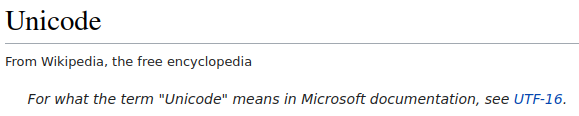

## Zeichenkodierungen 
* definieren die numerische Darstellung von Zeichen (Buchstaben, Ziffern & anderen
Symbolen)
* Beispiele: ASCII, UTF-8 (Standard im Web & auf Linux-Systemen), UTF-16 (Windows), ISO 646, ISO 8859-1
* Pas de probl�me?
- 
  <small>Quelle: <a href="https://en.wikipedia.org/wiki/Unicode">Unicode-Artikel in der englischsprachigen Wikipedia<a/></small>