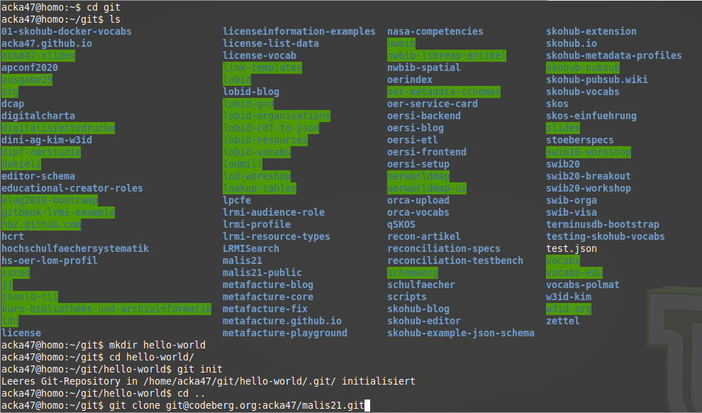
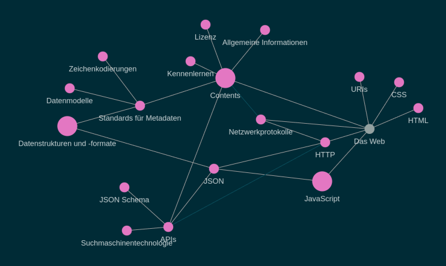
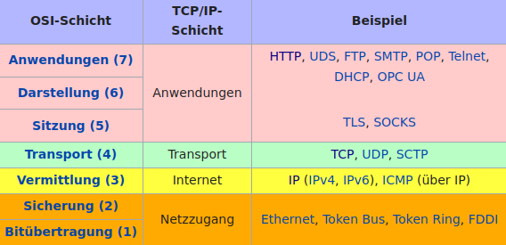
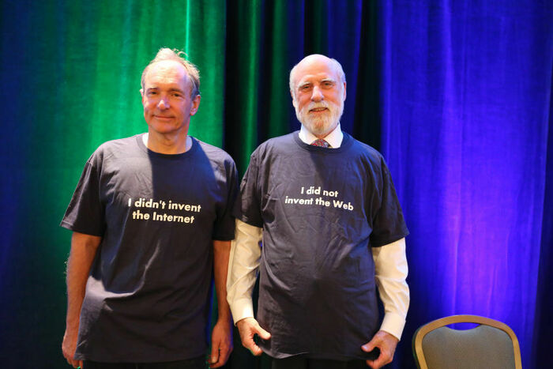
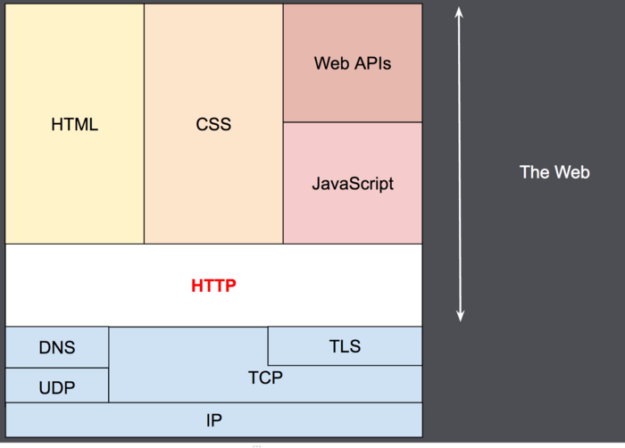
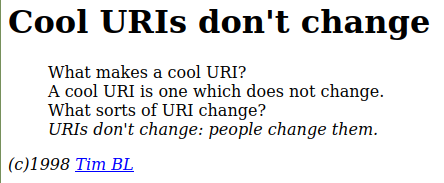
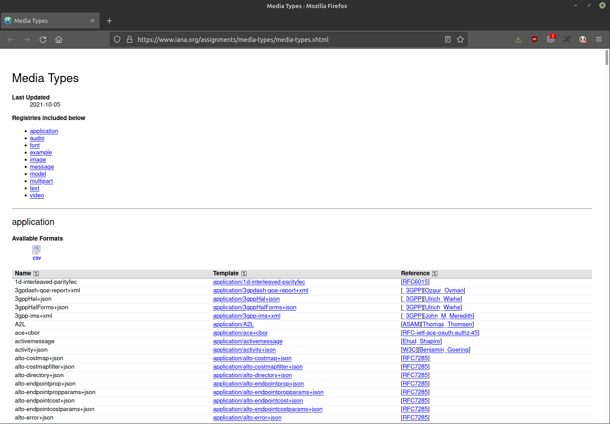
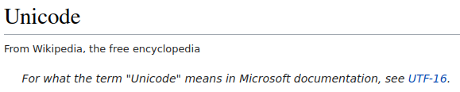
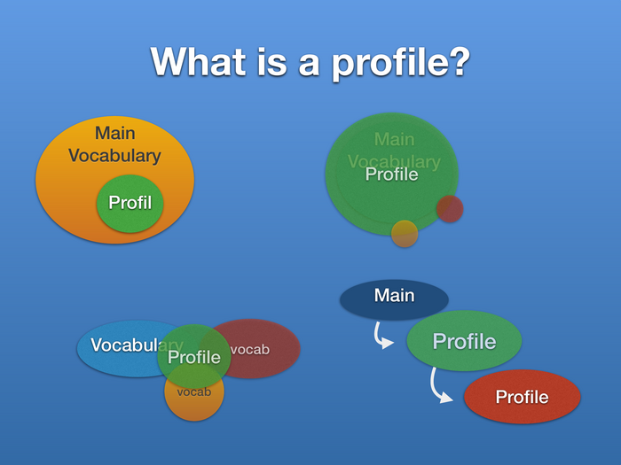

# MALIS21: Modul IT2  
Adrian Pohl
  
2021-10-13

[PDF](https://malis21.acka47.net/slides/2021-10-13.pdf)

---

## Dokumentation & Fragen in HedgeDoc
-> **[https://pad.gwdg.de/malis21-it2.1](https://pad.gwdg.de/malis21-it2.1)**

---

# Kennenlernen

---

## Werdegang
* https://orcid.org/0000-0001-9083-7442 
* Magister Kommunikationswissenschaft und Philosophie an der RWTH Aachen
* MALIS09-Absolvent ([Master Thesis](http://eprints.rclis.org/16175/))
* Seit 2008 im hbz, seit 2019-10 Leitung Offene Infrastruktur
* Co-Chair des [SWIB](https://swib.org)-Programmkomitees
* Moderation [OER-Metadatengruppe DINI AG KIM](https://wiki.dnb.de/display/DINIAGKIM/OER-Metadatengruppe)
* zum 1. Mal MALIS-Lehre

---

## Offene Infrastruktur
Nutzung und Pflege von Infrastruktur für die Publikation strukturierter Daten im Web:
* Offene Webstandards und darauf aufsetzend kooperative Entwicklung von Spezifikationen, z.b [AMB](https://dini-ag-kim.github.io/lrmi-profile/draft/)
* Transformation von Alt- und Fremddaten in web-kompatible Strukturen (mit [Metafacture](https://metafacture.org))
* Publikation strukturierter Daten im Web inkl. APIs ([lobid](https://lobid.org), [OERSI](https://oersi.de), [Skohub](https://skohub.io))

---

## Adrians Schwerpunkte
* Projekt-/Produktmanagement
* Datenmodellierung & Standards
* Funktionales Review
* kann keinen (guten) Softwarecode schreiben, ist aber integraler Bestandteil der Softwareentwicklung
* Artikel, Blogposts (z.B. [hier](https://blog.lobid.org/)), Workshops & Präsentationen (siehe [Slides](https://slides.lobid.org/))

---

## Und Sie?
* Moodle-Profile habe ich mir angeschaut
* Wir verzichten auf eine Vorstellungsrunde
* Stattdessen eine kleine Umfrage

---

## Kennen Sie den Unterschied zwischen dem Internet und dem Web?

---

## Wie häufig benutzen Sie einen Webbrowser?

---

## Markdown?

---

## Sonstige Erfahrungen mit Web-Technologien?

---

## Ein Auge für Daten?

---

## Kommandozeile?


---

## Schonmal einen git commit gemacht?

`$ git commit -am "Ergänze Folie 127"`

---

# Allgemeine Informationen

---

## Modul-Etikette

* Fragen sind stets willkommen
* Helfen Sie anderen, wo Sie können
* Seien Sie offen für unterschiedliche Fachkenntnisse & Erfahrungen
* Seien Sie freundlich

---

## Übungen in Präsenzphasen

* Abwechslung zu präsentationsorientiertem Frontalunterricht
* Bemächtigung grundlegende technische Fragen selbst zu beantworten
* Fähigkeit, Probleme von Bibliotheksdienstleistungen im Web zu identifizieren

---

## Arbeit im Web

* Moodle: geschlossenes System & nicht gerade intuitiv
* Materialien als OER zugänglich: [git Repo](https://codeberg.org/acka47/malis21), [HTML](https://malis21.acka47.net/) (siehe auch die [README.md](https://codeberg.org/acka47/malis21/src/branch/main/README.md))
* Aufgaben idealerweise auch einreichen via git (GitHub, GitLab, Codeberg) oder HedgeDoc
* Alternativ Dateiupload in Moodle möglich

---

## Aufgaben
  
Zwei Aufgaben in diesem Teilmodul: 
* 35%iger Gewichtung und maximal 25 Stunden Bearbeitungszeit:
* Abgabefrist Aufgabe 1: 09.01.2022
* Abgabefrist Aufgabe 2: 22.02.2022
Dazu zwei Aufgaben zu LZA von Frau Piesche

---

# Themenüberblick

---

## Überblick als Baum

siehe https://malis21.acka47.net/

---

## Überblick als Graph
siehe https://malis21.acka47.net/#/graph
- 

---

## Graph
"eine abstrakte Struktur, die eine Menge von Objekten zusammen mit den zwischen diesen Objekten bestehenden Verbindungen repräsentiert." ([Wikipedia](https://de.wikipedia.org/wiki/Graph_(Graphentheorie)))
Die Punkte heißen "Knoten" und die Verbindungen "Kanten".

---

## Kurze Zwischenfrage: Haben Sie Lust auf diese Themen?

---

# Netzwerk-protokolle

---

### Protokoll: "Festlegung von Standards und Konventionen für eine reibungslose Datenübertragung zwischen Computern"
([Duden](https://www.duden.de/rechtschreibung/Protokoll))

---

## Netzwerkprotokolle
* stellen den sicheren, fehlerfreien & zuverlässigen Austausch von Daten zwischen Rechnern sicher
* regeln die Prozesse des lesenden & schreibenden Zugriffs von einen Rechner auf einen anderen

---

## OSI-Referenzmodell 
* an der Datenübertragung in einem Computernetzwerk sind immer verschiedene Protokollschichten beteiligt
* z.B. setzen SMTP wie auch HTTP auf TCP/IP auf
* das OSI-Modell ist "ein Referenzmodell für Netzwerkprotokolle als Schichtenarchitektur" ([Wikipedia](https://de.wikipedia.org/w/index.php?title=OSI-Modell&oldid=215572834))

---


  <small>Quelle: Wikipedia-Seite <a href="https://de.wikipedia.org/wiki/Internetprotokollfamilie">"Internetprotokollfamilie"</a></small>

---

## Und DNS (Domain Name System)?
* Übersetzung von Domain-Namen (z.B. `lobid.org`) in IP-Adresse (`193.30.112.187`).
* Angesiedelt auf der Anwendungsebene des Internet, Übergang zur Vermittlungsebene (IP)

---

### HTTP ist das Transportprotokoll des Web auf der Anwendungsschicht des Internet.

---


<small>Der <a href="https://de.wikipedia.org/wiki/Tim_Berners-Lee">Vater des Web</a> und <a href="https://de.wikipedia.org/wiki/Vinton_G._Cerf">einer der Elternteile des Internet</a>, ©W3C (<a href="https://www.w3.org/20/img/event/0O4A8746_large.jpg">Quelle</a>)</small>

---

# Das Web

---

## The Web, aka World Wide Web, WWW

---

## "vague but exciting"
 
<small>Quelle: <a href="http://info.cern.ch/Proposal.html">http://info.cern.ch/Proposal.html</a></small>

---

## Die Grundbausteine des WWW
* basiert ursprünglich auf URIs, HTTP, HTML
* mit der Zeit kamen dazu: CSS, JavaScript

---

### Auf den Schultern des Internet


<small>Quelle: <a href="https://developer.mozilla.org/en-US/docs/Web/HTTP/Overview/http-layers.png">MDN</a>, Lizenz: <a href="https://creativecommons.org/licenses/by-sa/3.0/deed.locale">CC-BY-SA 3.0</a></small>

---

# URIs

---

## *Uniform* Resource Identifier

Einheitlichkeit durch Standardisierung ([RFC 3986](https://datatracker.ietf.org/doc/html/rfc3986))
```
       foo://example.com:8042/over/there?name=ferret#nose
       \_/   \______________/\_________/ \_________/ \__/
        |           |            |            |        |
     scheme     authority       path        query   fragment
        |   _____________________|__
       / \ /                        \
       urn:example:animal:ferret:nose
```
---

## Uniform *Resource* Identifier
* Ressource = jedes mögliche Ding
* Dinge, die über das Internet abgerufen werden können (Informationsressourcen) oder nicht-digitale Ressourcen (gedruckte Bücher, Personen, Gebäude, abstrakte Entitäten wie z.B. Organisationen oder ein Metadatenattribut)

---

## Uniform Resource *Identifier*
* identifizieren: etwas von allem anderen unterscheiden, indem wir eindeutig Bezug darauf nehmen
* Identifikation ist mit ID-Vergabe nur unter besonderen Bedingungen erreicht, sondern ist eng an die Angabe von unterscheidenden Merkmalen gekoppelt, (z.B. Name, Geburts-/Herstellungsdatum)

---

## Beispiele
[`http://lobid.org/resources/HT020657906#!`](http://lobid.org/resources/HT020657906#!)
`urn:nbn:de:hbz:6:2-1426138`
`doi:10.3278/6004804w`
`https://dx.doi.org/10.3278/6004804w`

---

## Weitere Beispiele
`mailto:hans.dampf@example.org`
`ftp://public.ftp-servers.example.com/mydirectory/myfile.txt`
`git@codeberg.org:acka47/malis21.git`
Siehe auch [IANA – Liste der URI Schemes](http://www.iana.org/assignments/uri-schemes/uri-schemes.xhtml)

---



<small><a href="https://www.w3.org/Provider/Style/URI.html">Quelle</a></small>

---

## Eine der wichtigsten Regeln
Wenn wir URIs einführen und nutzen, sollten wir uns Gedanken machen, wie wir ihre Beständigkeit und – bei HTTP-URIs – ihre langfristige Auflösbarkeit im Webbrowser sicherstellen können.

---

# HTTP

---

## HTTP – *Hyptertext* Transfer Protocol
* Ausdruck wurde in den 1960ern von [Ted Nelson](https://de.wikipedia.org/wiki/Theodor_Holm_Nelson) geprägt
* Grundidee: Schreiben/Denken und Publizieren in Form von Graphen, die sich mit Unterstützung von Maschinen auch leichte Weise beliebig anlegen und durchqueren lassen
* Die Ideen dahinter gehen u.a. zurück auf "[As we may think](https://de.wikipedia.org/wiki/As_We_May_Think)" von Vannevar Bush

---

## Geschichte (Ultrakurzfassung)
* 1989 begann die Entwicklung durch Tim Berners-Lee gemeinsam mit URI/URL und HTML
* aktuelle Version: HTTP/2 (seit Mai 2015)

---

## HTTP-Kommunikation besteht aus
1. Anfrage (Request): Client erbittet eine Aktion des Servers
 2. Antwort (Response): Server sendet Informationen und ggf.
angeforderte Daten zurück

---

## Eigenschaften von HTTP
* verbindungslos und zustandslos
* Unabhängig vom Medienformat

---


<small><a href="https://www.iana.org/assignments/media-types/media-types.xhtml">Liste der IANA Media Types</a></small>

---

## HTTP Request


---

### HTTP Response


---

#### HTTP-Verbindungen beim Aufruf einer Webseite


---


Bei einem HTTP-Request gibt es i. d. R. keine direkte Verbindung zwischen Client und Server, sondern viele Zwischenglieder (Proxies), die auf der Ebene des Webs irrelevant sind, sondern "nur" auf Ebene der transportorientieren Netzwerkprotokolle (z.B. TCP/IP) existieren.

---

## Status Codes – Übersicht

- 1xx – Informationen
- 2xx – Erfolgreiche Operation
- 3xx – Umleitung
- 4xx – Client-Fehler
- 5xx – Server-Fehler
- 9xx – Proprietäre Fehler

---

## Status Codes – Beispiele

- 200 OK
- 302 Found 
- 401 Unauthorized
- 404 Not Found
- 500 Internal Server Error

---

## HTTP-Methoden
Insgesamt neun Stück, hier die wichtigsten:
- `GET`
- `DELETE`
- `POST`
- `PUT`

---

## Tools

* [curl](https://curl.se/): umfassendes Tool zum Übertragen von Dateien in Rechnernetzen und [eines der weltweit meistgenutzten Open-Source-Projekte](https://daniel.haxx.se/blog/2018/09/17/the-worlds-biggest-curl-installations/). Kann als Programmbibliothek, auf der Kommandozeile oder im Browser genutzt werden unter [https://reqbin.com/curl](https://reqbin.com/curl).
* [wget](https://de.wikipedia.org/wiki/Wget): ähnlich wie curl, kann allerdings nur `GET` requests.

---

## Request Header & curl
* Bei einem HTTP Request kann ich im Accept Header angeben, welchen Media Type ich präferiere und der Server wird mir die Ressource entsprechend ausliefern, wenn er den Media Type untertützt
* Request Header werden in curl mit der Option `-H` gesetzt, z.B: `$ curl -H "accept: {IANA Media Type}" "{url}"`

---

## Übung 1: Request JSON mit curl
* **Frage:** Lässt sich die Liste der Open Textbook Library unter [https://open.umn.edu/opentextbooks/textbooks?page=1](https://open.umn.edu/opentextbooks/textbooks?page=1) auch als JSON bekommen?
* **Aufgabe:** Finden Sie in der [IANA Liste der Media Types](https://www.iana.org/assignments/media-types/media-types.xhtml) den Typ für JSON und formulieren Sie eine curl-Anfrage mit diesem Typ und der Open Textbook URL

---

## Response Header & curl

* Auch eine HTTP Response beinhaltet Header
* Um die Response Header mit curl zusätzlich zur Antwort auszugeben, muss die Option `-i` gesetzt werden und `-I` wenn nur die Response Header angezeigt werden sollen.

---

## Beispiel: Response Header
```
$ curl -I http://th-koeln.de
HTTP/1.0 302 Found
Location: https://th-koeln.de/
Server: BigIP
Connection: Keep-Alive
Content-Length: 0
```

---

## Übung 2: Response Header auswerten mit curl
* **Frage**: Lässt sich für eine ORCID JSON ausgeben?
* **Aufgabe**: Machen Sie eine Anfrage analog zu Übung 1 gegen eine ORCID.
* **Frage**: Warum kommt kein JSON zurück?
* **Aufgabe**: Lassen Sie sich die Response Header anzeigen. Was ist der Grund für das fehlende JSON?

---

## Umleitungen folgen mit curl

* Wie oben beschrieben, kann ein Server `3xx`-Codes zurückliefern mit einer Umleitung (Redirect) zu einer anderen Resource (meist `301 Moved Permanently` oder `302 Found`.
* Durch setzen der Option `-L` folgt curl solchen Redirects automatisch bis es nicht mehr weitergeht.

---

## Beispiel: Umleitungen folgen
```
$ curl -LI http://th-koeln.de
HTTP/1.0 302 Found
Location: https://th-koeln.de/
Server: BigIP
Connection: Keep-Alive
Content-Length: 0

HTTP/1.1 301 Moved Permanently
Date: Mon, 11 Oct 2021 20:11:59 GMT
Server: Apache
Location: https://www.th-koeln.de/
Connection: close
Content-Type: text/html; charset=iso-8859-1
Set-Cookie: BIGipServercms-public-live_prod_https=1594623627.47873.0000; path=/; Httponly; Secure

HTTP/1.1 200 OK
Date: Mon, 11 Oct 2021 20:12:03 GMT
Server: Apache
X-Powered-By: PHP/7.2.5
Set-Cookie: SimpleSAML=132d26b6460eb60fee530f15886d435a; path=/; HttpOnly
Expires: Thu, 19 Nov 1981 08:52:00 GMT
Cache-Control: no-cache, no-store, must-revalidate
Pragma: no-cache
X-UA-Compatible: IE=edge
Connection: close
Content-Type: text/html; charset=UTF-8
Set-Cookie: BIGipServercms-public-live_prod_https=1594623627.47873.0000; path=/; Httponly; Secure
```

---

## Übung 3: Umleitungen folgen mit curl

* **Frage**: Bekomme ich JSON von einer ORCID, wenn ich den Redirects folge?
* **Aufgabe**: Ergänzen Sie die ORCID-Abfrage aus Übung 2 um die Option zum Folgen von Umleitungen.

---

# HTML – Hypertext Markup Language

---

## *Hypertext* Markup Language
* Zu "Hypertext" siehe oben

---

## Hypertext *Markup Language*
* deutsch: Auszeichnungssprache

---

## Browser als HTML-Spielplatz

* Jede im Webbrowser aufgerufene HTML-Seite lässt sich dort editieren
* Einfach `STRG+Umschalt+i), z.B.:
 
<small><a href="https://twitter.com/JoachimKreische/status/1366688403396440064">https://twitter.com/JoachimKreische/status/1366688403396440064</a>, editiert in Firefox</small>

---

## Übung 4: HTML editieren

Editieren Sie – wie gerade beschrieben – eine Webseite Ihrer Wahl im Browser.

---

# CSS

---
## Cascading Style Sheets (CSS)
CSS  ist eine Sprache, um das Aussehen eines HTML-Dokuments im Browser zu konfigurieren

---

## Beispiel th-koeln.de

<small>Snippet aus <a href="https://www.th-koeln.de/css/css-min.css">https://www.th-koeln.de/css/css-min.css</a></small>
```json
@charset "utf-8";
html{
  font-size:100%;
  height:100%;
  -webkit-text-size-adjust:100%;
  -ms-text-size-adjust:100%
}
html,body,label,button,input,select,textarea{
  color:#000
}
body{
  background:#fff;
  font-size:1em;
  font-size:100.1%;
  line-height:1.4;
  margin:0;
  padding:0;
  text-align:left
}
```

---

# JavaScript

---

# JavaScript
auch "JS" genannt; nicht zu verwechseln mit Java

---

## JS
* eine **Programmiersprache**, 
* die standardmäßig für die Umsetzung dynamischer Webseiten genutzt wird, wobei die Ausführung im Browser ("clientseitig") stattfindet.
* Mit dem Aufstieg von Node.js fand JavaScript zunehmend auch serverseitig Verwendung.

---

# Standards für Metadaten

---

## Standard:
"etwas, was als mustergültig, modellhaft angesehen wird und wonach sich anderes richtet; Richtschnur, Maßstab, Norm"

<small>(<a href="https://www.duden.de/rechtschreibung/Standard_Norm_Richtmasz_Guete">Duden</a>)</small>

---

## Arten von Standards
Standard durch Normierung
vs.
De-Facto-Standard

---

## Erwünschte Eigenschaften

* offener Prozess innerhalb einer gemeinnützigen Organisation
* transparente Entwicklung
* kostenfrei, weltweit zugänglich
* die Anwendung des Standards unterliegt keinen Einschränkungen

---

### Pluspunkt: Ein Problem lösen, das noch nicht gelöst ist


<small><a href="https://xkcd.com/927/">Standards</a> by xkcd, CC-BY-NC</small>

---

## Standards für Metadaten

* Zeichenkodierungen
* Datenstrukturen und -formate
* Datenmodelle & Profile
  
---

# Zeichen-kodierungen

---

## Zeichenkodierungen 

* definieren die numerische Darstellung von Zeichen (Buchstaben, Ziffern & anderen
Symbolen)
* Beispiele: ASCII, UTF-8 (Standard im Web & auf Linux-Systemen), UTF-16 (Windows), ISO 646, ISO 8859-1
* Pas de probl�me?

---

## Bsp.: Unicode Character "è" (U+00E8)
* Unicode ist eine Zeichenkodierung, die praktisch durch Unicode Transformation Formats (UTF) implementiert wird:
* UTF-8 Encoding: `0xC3 0xA8`
* UTF-16 Encoding: `0x00E8`
* UTF-32 Encoding: `0x000000E8`

---

### Oft wird nicht unterschieden zwischen Unicode und UTF

<small>Quelle: <a href="https://en.wikipedia.org/wiki/Unicode">Unicode-Artikel in der englischsprachigen Wikipedia<a/></small>

---

# Datenstrukturen und -formate

---

## Quiz: Welches Datenformat ist das?

---

### Format 0
```
Leader/00-23 	*****nam##22*****#a#4500
001 	<control number>
003 	<control number identifier>
005 	19920331092212.7
007/00-01 	ta
008/00-39 	820305s1991####nyu###########001#0#eng##
020 	##$a0845348116 :$c$29.95 (£19.50 U.K.)
020 	##$a0845348205 (pbk.)
040 	##$a[organization code]$c[organization code]
050 	14$aPN1992.8.S4$bT47 1991
082 	04$a791.45/75/0973$219
100 	1#$aTerrace, Vincent,$d1948-
245 	10$aFifty years of television :$ba guide to series and pilots, 1937-1988 /$cVincent Terrace.
246 	1#$a50 years of television
260 	##$aNew York :$bCornwall Books,$cc1991.
300 	##$a864 p. ;$c24 cm.
500 	##$aIncludes index.
650 	#0$aTelevision pilot programs$zUnited States$vCatalogs.
650 	#0$aTelevision serials$zUnited States$vCatalogs.
```

---

### Format 1

```xml
<?xml version="1.0" encoding="UTF-8"?>
  <record xmlns="http://www.loc.gov/MARC21/slim" type="Bibliographic">
    <leader>00000pam a2200000 c 4500</leader>
    <controlfield tag="001">1135496102</controlfield>
    <controlfield tag="003">DE-101</controlfield>
    <controlfield tag="005">20181016124329.0</controlfield>
    <controlfield tag="007">tu</controlfield>
    <controlfield tag="008">170616s2017    gw ||||| |||| 00||||ger  </controlfield>
    <datafield tag="015" ind1=" " ind2=" ">
      <subfield code="a">17,A50</subfield>
      <subfield code="z">17,N25</subfield>
      <subfield code="2">dnb</subfield>
    </datafield>
    <datafield tag="016" ind1="7" ind2=" ">
      <subfield code="2">DE-101</subfield>
      <subfield code="a">1135496102</subfield>
    </datafield>
    <datafield tag="020" ind1=" " ind2=" ">
      <subfield code="a">9783110538687</subfield>
      <subfield code="c">Broschur : EUR 39.95 (DE), EUR 39.95 (AT)</subfield>
      <subfield code="9">978-3-11-053868-7</subfield>
    </datafield>
    <datafield tag="020" ind1=" " ind2=" ">
      <subfield code="a">3110538687</subfield>
      <subfield code="9">3-11-053868-7</subfield>
    </datafield>
    <datafield tag="024" ind1="3" ind2=" ">
      <subfield code="a">9783110538687</subfield>
    </datafield>
    <datafield tag="035" ind1=" " ind2=" ">
      <subfield code="a">(DE-599)DNB1135496102</subfield>
    </datafield>
    <datafield tag="035" ind1=" " ind2=" ">
      <subfield code="a">(OCoLC)990783865</subfield>
    </datafield>
    <datafield tag="040" ind1=" " ind2=" ">
      <subfield code="a">1145</subfield>
      <subfield code="b">ger</subfield>
      <subfield code="c">DE-101</subfield>
      <subfield code="d">1131</subfield>
      <subfield code="e">rda</subfield>
    </datafield>
    <datafield tag="041" ind1=" " ind2=" ">
      <subfield code="a">ger</subfield>
    </datafield>
    <datafield tag="044" ind1=" " ind2=" ">
      <subfield code="c">XA-DE-BE</subfield>
    </datafield>
    <datafield tag="082" ind1="0" ind2="4">
      <subfield code="8">1\u</subfield>
      <subfield code="a">025.3</subfield>
      <subfield code="q">DE-101</subfield>
      <subfield code="2">22/ger</subfield>
    </datafield>
    <datafield tag="083" ind1="7" ind2=" ">
      <subfield code="a">020</subfield>
      <subfield code="q">DE-101</subfield>
      <subfield code="2">23sdnb</subfield>
    </datafield>
    <datafield tag="085" ind1=" " ind2=" ">
      <subfield code="8">1\u</subfield>
      <subfield code="b">025.3</subfield>
    </datafield>
    <datafield tag="090" ind1=" " ind2=" ">
      <subfield code="a">b</subfield>
    </datafield>
    <datafield tag="100" ind1="1" ind2=" ">
      <subfield code="0">(DE-588)122087801</subfield>
      <subfield code="0">https://d-nb.info/gnd/122087801</subfield>
      <subfield code="0">(DE-101)122087801</subfield>
      <subfield code="a">Wiesenmüller, Heidrun</subfield>
      <subfield code="d">1968-</subfield>
      <subfield code="e">Verfasser</subfield>
      <subfield code="4">aut</subfield>
      <subfield code="2">gnd</subfield>
    </datafield>
    <datafield tag="245" ind1="1" ind2="0">
      <subfield code="a">Basiswissen RDA</subfield>
      <subfield code="b">eine Einführung für deutschsprachige Anwender</subfield>
      <subfield code="c">Heidrun Wiesenmüller und Silke Horny</subfield>
    </datafield>
    <datafield tag="250" ind1=" " ind2=" ">
      <subfield code="a">2., überarbeitete und erweiterte Auflage</subfield>
    </datafield>
    <datafield tag="259" ind1=" " ind2=" ">
      <subfield code="a">12</subfield>
    </datafield>
    <datafield tag="264" ind1=" " ind2="1">
      <subfield code="a">Berlin</subfield>
      <subfield code="b">De Gruyter Saur</subfield>
      <subfield code="c">[2017]</subfield>
    </datafield>
    <datafield tag="300" ind1=" " ind2=" ">
      <subfield code="a">XXII, 326 Seiten</subfield>
      <subfield code="b">Illustrationen</subfield>
      <subfield code="c">28 cm</subfield>
    </datafield>
    <datafield tag="336" ind1=" " ind2=" ">
      <subfield code="a">Text</subfield>
      <subfield code="b">txt</subfield>
      <subfield code="2">rdacontent</subfield>
    </datafield>
    <datafield tag="337" ind1=" " ind2=" ">
      <subfield code="a">ohne Hilfsmittel zu benutzen</subfield>
      <subfield code="b">n</subfield>
      <subfield code="2">rdamedia</subfield>
    </datafield>
    <datafield tag="338" ind1=" " ind2=" ">
      <subfield code="a">Band</subfield>
      <subfield code="b">nc</subfield>
      <subfield code="2">rdacarrier</subfield>
    </datafield>
    <datafield tag="490" ind1="0" ind2=" ">
      <subfield code="a">Studium</subfield>
    </datafield>
    <datafield tag="630" ind1="0" ind2="7">
      <subfield code="0">(DE-588)7710221-6</subfield>
      <subfield code="0">https://d-nb.info/gnd/7710221-6</subfield>
      <subfield code="0">(DE-101)1004909225</subfield>
      <subfield code="a">Resource description and access</subfield>
      <subfield code="9">rswk-swf</subfield>
      <subfield code="2">gnd</subfield>
    </datafield>
    <datafield tag="653" ind1=" " ind2=" ">
      <subfield code="a">(Produktform)Paperback / softback</subfield>
    </datafield>
    <datafield tag="653" ind1=" " ind2=" ">
      <subfield code="a">(Zielgruppe)Fachhochschul-/Hochschulausbildung</subfield>
    </datafield>
    <datafield tag="653" ind1=" " ind2=" ">
      <subfield code="a">(BISAC Subject Heading)LAN025000</subfield>
    </datafield>
    <datafield tag="653" ind1=" " ind2=" ">
      <subfield code="a">Indexing</subfield>
    </datafield>
    <datafield tag="653" ind1=" " ind2=" ">
      <subfield code="a">cataloguing</subfield>
    </datafield>
    <datafield tag="653" ind1=" " ind2=" ">
      <subfield code="a">information organization</subfield>
    </datafield>
    <datafield tag="653" ind1=" " ind2=" ">
      <subfield code="a">library sciences</subfield>
    </datafield>
    <datafield tag="653" ind1=" " ind2=" ">
      <subfield code="a">Bibliothekswissenschaft</subfield>
    </datafield>
    <datafield tag="653" ind1=" " ind2=" ">
      <subfield code="a">Erschließung</subfield>
    </datafield>
    <datafield tag="653" ind1=" " ind2=" ">
      <subfield code="a">Informationsorganisation</subfield>
    </datafield>
    <datafield tag="653" ind1=" " ind2=" ">
      <subfield code="a">Katalogisierung</subfield>
    </datafield>
    <datafield tag="653" ind1=" " ind2=" ">
      <subfield code="a">(Produktrabattgruppe)PN: nicht rabattbeschränkt/Sortimentstitel</subfield>
    </datafield>
    <datafield tag="653" ind1=" " ind2=" ">
      <subfield code="a">(BISAC Subject Heading)LAN025000</subfield>
    </datafield>
    <datafield tag="653" ind1=" " ind2=" ">
      <subfield code="a">(VLB-WN)1743: Hardcover, Softcover / Medien, Kommunikation/Buchhandel, Bibliothekswesen</subfield>
    </datafield>
    <datafield tag="653" ind1=" " ind2=" ">
      <subfield code="a">Indexing; cataloguing; library sciences; information organization</subfield>
    </datafield>
    <datafield tag="653" ind1=" " ind2=" ">
      <subfield code="a">TB: Textbook</subfield>
    </datafield>
    <datafield tag="655" ind1=" " ind2="7">
      <subfield code="0">(DE-588)4123623-3</subfield>
      <subfield code="0">https://d-nb.info/gnd/4123623-3</subfield>
      <subfield code="0">(DE-101)041236238</subfield>
      <subfield code="a">Lehrbuch</subfield>
      <subfield code="2">gnd-content</subfield>
    </datafield>
    <datafield tag="689" ind1="0" ind2="0">
      <subfield code="0">(DE-588)7710221-6</subfield>
      <subfield code="0">https://d-nb.info/gnd/7710221-6</subfield>
      <subfield code="0">(DE-101)1004909225</subfield>
      <subfield code="D">u</subfield>
      <subfield code="a">Resource description and access</subfield>
    </datafield>
    <datafield tag="689" ind1="0" ind2=" ">
      <subfield code="5">DE-101</subfield>
      <subfield code="5">DE-101</subfield>
    </datafield>
    <datafield tag="700" ind1="1" ind2=" ">
      <subfield code="0">(DE-588)106745389X</subfield>
      <subfield code="0">https://d-nb.info/gnd/106745389X</subfield>
      <subfield code="0">(DE-101)106745389X</subfield>
      <subfield code="a">Horny, Silke</subfield>
      <subfield code="e">Verfasser</subfield>
      <subfield code="4">aut</subfield>
      <subfield code="2">gnd</subfield>
    </datafield>
    <datafield tag="710" ind1="2" ind2=" ">
      <subfield code="0">(DE-588)1065173075</subfield>
      <subfield code="0">https://d-nb.info/gnd/1065173075</subfield>
      <subfield code="0">(DE-101)1065173075</subfield>
      <subfield code="a">Saur, K. G., Verlag</subfield>
      <subfield code="e">Verlag</subfield>
      <subfield code="4">pbl</subfield>
      <subfield code="2">gnd</subfield>
    </datafield>
    <datafield tag="776" ind1="0" ind2="8">
      <subfield code="i">Erscheint auch als</subfield>
      <subfield code="n">Online-Ausgabe</subfield>
      <subfield code="a">Wiesenmüller, Heidrun, 1968-</subfield>
      <subfield code="t">Basiswissen RDA</subfield>
      <subfield code="d">Berlin/Boston : De Gruyter, 2017</subfield>
      <subfield code="h">Online-Ressourcen, 348 Seiten</subfield>
      <subfield code="w">(DE-101)1140817132</subfield>
      <subfield code="b">2., überarbeitete und erweiterte Auflage</subfield>
    </datafield>
    <datafield tag="850" ind1=" " ind2=" ">
      <subfield code="a">DE-101a</subfield>
      <subfield code="a">DE-101b</subfield>
    </datafield>
    <datafield tag="856" ind1="4" ind2="2">
      <subfield code="m">X:MVB</subfield>
      <subfield code="u">http://www.degruyter.com/search?f_0=isbnissn&amp;q_0=9783110538687&amp;searchTitles=true</subfield>
    </datafield>
    <datafield tag="856" ind1="4" ind2="2">
      <subfield code="m">B:DE-101</subfield>
      <subfield code="q">application/pdf</subfield>
      <subfield code="u">https://d-nb.info/1135496102/04</subfield>
      <subfield code="3">Inhaltsverzeichnis</subfield>
    </datafield>
    <datafield tag="925" ind1="r" ind2=" ">
      <subfield code="a">ra</subfield>
    </datafield>
  </record>
```

---

### Format 2
```turtle
@prefix owl: <http://www.w3.org/2002/07/owl#> .
@prefix xsd: <http://www.w3.org/2001/XMLSchema#> .
@prefix rdau: <http://rdaregistry.info/Elements/u/> .
@prefix dcterms: <http://purl.org/dc/terms/> .
@prefix isbd: <http://iflastandards.info/ns/isbd/elements/> .
@prefix marcRole: <http://id.loc.gov/vocabulary/relators/> .
@prefix wdrs: <http://www.w3.org/2007/05/powder-s#> .
@prefix bibo: <http://purl.org/ontology/bibo/> .
@prefix dc: <http://purl.org/dc/elements/1.1/> . 

<https://d-nb.info/1135496102> a bibo:Document;
dcterms:medium <http://rdaregistry.info/termList/RDACarrierType/1044>;
rdau:P60049 <http://rdaregistry.info/termList/RDAContentType/1020>;
rdau:P60050 <http://rdaregistry.info/termList/RDAMediaType/1007>;
rdau:P60048 <http://rdaregistry.info/termList/RDACarrierType/1049>;
dc:identifier "(DE-101)1135496102";
bibo:isbn13 "9783110538687";
rdau:P60521 "Broschur : EUR 39.95 (DE), EUR 39.95 (AT)";
bibo:isbn10 "3110538687";
bibo:gtin14 "9783110538687";
dc:identifier "(OCoLC)990783865";
dcterms:language <http://id.loc.gov/vocabulary/iso639-2/ger>;
rdau:P60049 <https://d-nb.info/gnd/4123623-3>;
rdau:P60327 "Heidrun Wiesenmüller und Silke Horny";
dc:title "Basiswissen RDA";
dcterms:creator <https://d-nb.info/gnd/122087801>;
marcRole:aut <https://d-nb.info/gnd/122087801>, <https://d-nb.info/gnd/106745389X>;
marcRole:pbl <https://d-nb.info/gnd/1065173075>;
bibo:edition "2., überarbeitete und erweiterte Auflage";
dc:publisher "De Gruyter Saur";
rdau:P60163 "Berlin";
rdau:P60333 "Berlin : De Gruyter Saur, [2017]";
rdau:P60539 "28 cm";
rdau:P60470 "Illustrationen"@de;
dcterms:isPartOf "Studium";
dcterms:isFormatOf <https://d-nb.info/1140817132>;
dcterms:subject <https://d-nb.info/gnd/7710221-6>;
dc:subject "020"^^dnbt:ddc-subject-category;
dcterms:subject <http://dewey.info/class/025.3/e22/>;
dcterms:tableOfContents <https://d-nb.info/1135496102/04>;
wdrs:describedby <https://d-nb.info/1135496102/about> . 
<https://d-nb.info/1135496102/about> dcterms:license <http://creativecommons.org/publicdomain/zero/1.0/>;
dcterms:modified "2018-10-16T12:43:29.000"^^xsd:dateTime . 
<https://d-nb.info/1135496102> dcterms:issued "2017";
rdau:P60493 "eine Einführung für deutschsprachige Anwender";
isbd:P1053 "XXII, 326 Seiten";
owl:sameAs <http://hub.culturegraph.org/resource/DNB-1135496102> .
```

---

### Format 3
```xml
<?xml version="1.0" encoding="UTF-8"?>
<rdf:RDF xmlns:rdf="http://www.w3.org/1999/02/22-rdf-syntax-ns#"
        xmlns:bf="http://id.loc.gov/ontologies/bibframe/"
        xmlns:bflc="http://id.loc.gov/ontologies/bflc/"
        xmlns:madsrdf="http://www.loc.gov/mads/rdf/v1#"
        xmlns:rdfs="http://www.w3.org/2000/01/rdf-schema#">
    <bf:Work rdf:about="https://d-nb.info/1135496102#Work">
    <bf:adminMetadata>
        <bf:AdminMetadata>
            <bf:generationProcess>
                <bf:GenerationProcess>
                <rdfs:label>DLC marc2bibframe2 v1.5.1</rdfs:label>
                </bf:GenerationProcess>
            </bf:generationProcess>
            <bf:status>
                <bf:Status>
                <rdfs:label>increase in encoding level from prepublication</rdfs:label>
                <bf:code>p</bf:code>
                </bf:Status>
            </bf:status>
            <bflc:encodingLevel>
                <bflc:EncodingLevel rdf:about="http://id.loc.gov/vocabulary/menclvl/f">
                <rdfs:label>full</rdfs:label>
                </bflc:EncodingLevel>
            </bflc:encodingLevel>
            <bf:descriptionConventions>
                <bf:DescriptionConventions rdf:about="http://id.loc.gov/vocabulary/descriptionConventions/isbd">
                <rdfs:label>isbd</rdfs:label>
                </bf:DescriptionConventions>
            </bf:descriptionConventions>
            <bf:identifiedBy>
                <bf:Local>
                <rdf:value>1135496102</rdf:value>
                <bf:assigner>
                    <bf:Agent>
                        <bf:code>DE-101</bf:code>
                    </bf:Agent>
                </bf:assigner>
                </bf:Local>
            </bf:identifiedBy>
            <bf:changeDate rdf:datatype="http://www.w3.org/2001/XMLSchema#dateTime">2018-10-16T12:43:29</bf:changeDate>
            <bf:creationDate rdf:datatype="http://www.w3.org/2001/XMLSchema#date">2017-06-16</bf:creationDate>
            <bf:identifiedBy>
                <bf:Local>
                <rdf:value>1135496102</rdf:value>
                <bf:source>
                    <bf:Source>
                        <rdfs:label>DE-101</rdfs:label>
                    </bf:Source>
                </bf:source>
                </bf:Local>
            </bf:identifiedBy>
            <bf:source>
                <bf:Source>
                <rdf:type rdf:resource="http://id.loc.gov/ontologies/bibframe/Agent"/>
                <rdfs:label>1145</rdfs:label>
                </bf:Source>
            </bf:source>
            <bf:source>
                <bf:Source>
                <rdf:type rdf:resource="http://id.loc.gov/ontologies/bibframe/Agent"/>
                <rdfs:label>DE-101</rdfs:label>
                </bf:Source>
            </bf:source>
            <bf:descriptionLanguage>
                <bf:Language rdf:about="http://id.loc.gov/vocabulary/languages/ger">
                <bf:code>ger</bf:code>
                </bf:Language>
            </bf:descriptionLanguage>
            <bf:descriptionModifier>
                <bf:Agent>
                <rdfs:label>1131</rdfs:label>
                </bf:Agent>
            </bf:descriptionModifier>
            <bf:descriptionConventions>
                <bf:DescriptionConventions rdf:about="http://id.loc.gov/vocabulary/descriptionConventions/rda">
                <rdfs:label>rda</rdfs:label>
                </bf:DescriptionConventions>
            </bf:descriptionConventions>
        </bf:AdminMetadata>
    </bf:adminMetadata>
    <rdf:type rdf:resource="http://id.loc.gov/ontologies/bibframe/Text"/>
    <bf:language>
        <bf:Language rdf:about="http://id.loc.gov/vocabulary/languages/ger"/>
    </bf:language>
    <bf:language>
        <bf:Language>
            <rdf:value rdf:resource="http://id.loc.gov/vocabulary/languages/ger"/>
        </bf:Language>
    </bf:language>
    <bf:classification>
        <bf:ClassificationDdc>
            <bf:classificationPortion>025.3</bf:classificationPortion>
            <bf:edition>22/ger</bf:edition>
            <bf:edition>full</bf:edition>
        </bf:ClassificationDdc>
    </bf:classification>
    <bf:contribution>
        <bf:Contribution>
            <rdf:type rdf:resource="http://id.loc.gov/ontologies/bflc/PrimaryContribution"/>
            <bf:agent>
                <bf:Agent rdf:about="https://d-nb.info/gnd/122087801">
                <rdf:type rdf:resource="http://id.loc.gov/ontologies/bibframe/Person"/>
                <bflc:name00MatchKey>Wiesenmüller, Heidrun 1968-</bflc:name00MatchKey>
                <bflc:primaryContributorName00MatchKey>Wiesenmüller, Heidrun 1968-</bflc:primaryContributorName00MatchKey>
                <bflc:name00MarcKey>1001 $0(DE-588)122087801$0https://d-nb.info/gnd/122087801$0(DE-101)122087801$aWiesenmüller, Heidrun$d1968-$eVerfasser$4aut$2gnd</bflc:name00MarcKey>
                <rdfs:label>Wiesenmüller, Heidrun 1968-</rdfs:label>
                <bf:identifiedBy>
                    <bf:Identifier>
                        <rdf:value>122087801</rdf:value>
                        <bf:source>
                            <bf:Source>
                            <rdfs:label>DE-588</rdfs:label>
                            </bf:Source>
                        </bf:source>
                    </bf:Identifier>
                </bf:identifiedBy>
                <bf:identifiedBy>
                    <bf:Identifier>
                        <rdf:value>122087801</rdf:value>
                        <bf:source>
                            <bf:Source>
                            <rdfs:label>DE-101</rdfs:label>
                            </bf:Source>
                        </bf:source>
                    </bf:Identifier>
                </bf:identifiedBy>
                <bf:source>
                    <bf:Source>
                        <rdfs:label>gnd</rdfs:label>
                    </bf:Source>
                </bf:source>
                </bf:Agent>
            </bf:agent>
            <bf:role>
                <bf:Role>
                <rdfs:label>Verfasser</rdfs:label>
                <bflc:relatorMatchKey>Verfasser</bflc:relatorMatchKey>
                </bf:Role>
            </bf:role>
            <bf:role>
                <bf:Role rdf:about="http://id.loc.gov/vocabulary/relators/aut"/>
            </bf:role>
        </bf:Contribution>
    </bf:contribution>
    <rdfs:label>Basiswissen RDA</rdfs:label>
    <bf:title>
        <bf:Title>
            <rdfs:label>Basiswissen RDA</rdfs:label>
            <bflc:titleSortKey>Basiswissen RDA</bflc:titleSortKey>
            <bf:mainTitle>Basiswissen RDA</bf:mainTitle>
        </bf:Title>
    </bf:title>
    <bf:content>
        <bf:Content rdf:about="http://id.loc.gov/vocabulary/contentTypes/txt">
            <rdfs:label>Text</rdfs:label>
            <bf:source>
                <bf:Source rdf:about="http://id.loc.gov/vocabulary/genreFormSchemes/rdacontent"/>
            </bf:source>
        </bf:Content>
    </bf:content>
    <bf:subject>
        <bf:Work rdf:about="https://d-nb.info/gnd/7710221-6">
            <rdf:type rdf:resource="http://www.loc.gov/mads/rdf/v1#"/>
            <madsrdf:authoritativeLabel>Resource description and access</madsrdf:authoritativeLabel>
            <bf:source>
                <bf:Source>
                <bf:code>gnd</bf:code>
                </bf:Source>
            </bf:source>
            <rdfs:label>Resource description and access</rdfs:label>
            <bf:title>
                <bf:Title>
                <bflc:title30MatchKey>Resource description and access</bflc:title30MatchKey>
                <bflc:title30MarcKey>63007$0(DE-588)7710221-6$0https://d-nb.info/gnd/7710221-6$0(DE-101)1004909225$aResource description and access$9rswk-swf$2gnd</bflc:title30MarcKey>
                <rdfs:label>Resource description and access</rdfs:label>
                <bflc:titleSortKey>Resource description and access</bflc:titleSortKey>
                <bf:mainTitle>Resource description and access</bf:mainTitle>
                </bf:Title>
            </bf:title>
            <bf:identifiedBy>
                <bf:Identifier>
                <rdf:value>7710221-6</rdf:value>
                <bf:source>
                    <bf:Source>
                        <rdfs:label>DE-588</rdfs:label>
                    </bf:Source>
                </bf:source>
                </bf:Identifier>
            </bf:identifiedBy>
            <bf:identifiedBy>
                <bf:Identifier>
                <rdf:value>1004909225</rdf:value>
                <bf:source>
                    <bf:Source>
                        <rdfs:label>DE-101</rdfs:label>
                    </bf:Source>
                </bf:source>
                </bf:Identifier>
            </bf:identifiedBy>
            <bf:source>
                <bf:Source>
                <rdfs:label>gnd</rdfs:label>
                </bf:Source>
            </bf:source>
        </bf:Work>
    </bf:subject>
    <bf:subject>
        <bf:Topic>
            <rdfs:label>(Produktform)Paperback / softback</rdfs:label>
        </bf:Topic>
    </bf:subject>
    <bf:subject>
        <bf:Topic>
            <rdfs:label>(Zielgruppe)Fachhochschul-/Hochschulausbildung</rdfs:label>
        </bf:Topic>
    </bf:subject>
    <bf:subject>
        <bf:Topic>
            <rdfs:label>(BISAC Subject Heading)LAN025000</rdfs:label>
        </bf:Topic>
    </bf:subject>
    <bf:subject>
        <bf:Topic>
            <rdfs:label>Indexing</rdfs:label>
        </bf:Topic>
    </bf:subject>
    <bf:subject>
        <bf:Topic>
            <rdfs:label>cataloguing</rdfs:label>
        </bf:Topic>
    </bf:subject>
    <bf:subject>
        <bf:Topic>
            <rdfs:label>information organization</rdfs:label>
        </bf:Topic>
    </bf:subject>
    <bf:subject>
        <bf:Topic>
            <rdfs:label>library sciences</rdfs:label>
        </bf:Topic>
    </bf:subject>
    <bf:subject>
        <bf:Topic>
            <rdfs:label>Bibliothekswissenschaft</rdfs:label>
        </bf:Topic>
    </bf:subject>
    <bf:subject>
        <bf:Topic>
            <rdfs:label>Erschließung</rdfs:label>
        </bf:Topic>
    </bf:subject>
    <bf:subject>
        <bf:Topic>
            <rdfs:label>Informationsorganisation</rdfs:label>
        </bf:Topic>
    </bf:subject>
    <bf:subject>
        <bf:Topic>
            <rdfs:label>Katalogisierung</rdfs:label>
        </bf:Topic>
    </bf:subject>
    <bf:subject>
        <bf:Topic>
            <rdfs:label>(Produktrabattgruppe)PN: nicht rabattbeschränkt/Sortimentstitel</rdfs:label>
        </bf:Topic>
    </bf:subject>
    <bf:subject>
        <bf:Topic>
            <rdfs:label>(BISAC Subject Heading)LAN025000</rdfs:label>
        </bf:Topic>
    </bf:subject>
    <bf:subject>
        <bf:Topic>
            <rdfs:label>(VLB-WN)1743: Hardcover, Softcover / Medien, Kommunikation/Buchhandel, Bibliothekswesen</rdfs:label>
        </bf:Topic>
    </bf:subject>
    <bf:subject>
        <bf:Topic>
            <rdfs:label>Indexing; cataloguing; library sciences; information organization</rdfs:label>
        </bf:Topic>
    </bf:subject>
    <bf:subject>
        <bf:Topic>
            <rdfs:label>TB: Textbook</rdfs:label>
        </bf:Topic>
    </bf:subject>
    <bf:genreForm>
        <bf:GenreForm rdf:about="https://d-nb.info/gnd/4123623-3">
            <rdf:type rdf:resource="http://www.loc.gov/mads/rdf/v1#Topic"/>
            <rdfs:label>Lehrbuch</rdfs:label>
            <madsrdf:authoritativeLabel>Lehrbuch</madsrdf:authoritativeLabel>
            <bf:source>
                <bf:Source>
                <bf:code>gnd-content</bf:code>
                </bf:Source>
            </bf:source>
            <bf:identifiedBy>
                <bf:Identifier>
                <rdf:value>4123623-3</rdf:value>
                <bf:source>
                    <bf:Source>
                        <rdfs:label>DE-588</rdfs:label>
                    </bf:Source>
                </bf:source>
                </bf:Identifier>
            </bf:identifiedBy>
            <bf:identifiedBy>
                <bf:Identifier>
                <rdf:value>041236238</rdf:value>
                <bf:source>
                    <bf:Source>
                        <rdfs:label>DE-101</rdfs:label>
                    </bf:Source>
                </bf:source>
                </bf:Identifier>
            </bf:identifiedBy>
        </bf:GenreForm>
    </bf:genreForm>
    <bf:contribution>
        <bf:Contribution>
            <bf:agent>
                <bf:Agent rdf:about="https://d-nb.info/gnd/106745389X">
                <rdf:type rdf:resource="http://id.loc.gov/ontologies/bibframe/Person"/>
                <bflc:name00MatchKey>Horny, Silke</bflc:name00MatchKey>
                <bflc:name00MarcKey>7001 $0(DE-588)106745389X$0https://d-nb.info/gnd/106745389X$0(DE-101)106745389X$aHorny, Silke$eVerfasser$4aut$2gnd</bflc:name00MarcKey>
                <rdfs:label>Horny, Silke</rdfs:label>
                <bf:identifiedBy>
                    <bf:Identifier>
                        <rdf:value>106745389X</rdf:value>
                        <bf:source>
                            <bf:Source>
                            <rdfs:label>DE-588</rdfs:label>
                            </bf:Source>
                        </bf:source>
                    </bf:Identifier>
                </bf:identifiedBy>
                <bf:identifiedBy>
                    <bf:Identifier>
                        <rdf:value>106745389X</rdf:value>
                        <bf:source>
                            <bf:Source>
                            <rdfs:label>DE-101</rdfs:label>
                            </bf:Source>
                        </bf:source>
                    </bf:Identifier>
                </bf:identifiedBy>
                <bf:source>
                    <bf:Source>
                        <rdfs:label>gnd</rdfs:label>
                    </bf:Source>
                </bf:source>
                </bf:Agent>
            </bf:agent>
            <bf:role>
                <bf:Role>
                <rdfs:label>Verfasser</rdfs:label>
                <bflc:relatorMatchKey>Verfasser</bflc:relatorMatchKey>
                </bf:Role>
            </bf:role>
            <bf:role>
                <bf:Role rdf:about="http://id.loc.gov/vocabulary/relators/aut"/>
            </bf:role>
        </bf:Contribution>
    </bf:contribution>
    <bf:contribution>
        <bf:Contribution>
            <bf:agent>
                <bf:Agent rdf:about="https://d-nb.info/gnd/1065173075">
                <rdf:type rdf:resource="http://id.loc.gov/ontologies/bibframe/Organization"/>
                <bflc:name10MatchKey>Saur, K. G., Verlag</bflc:name10MatchKey>
                <bflc:name10MarcKey>7102 $0(DE-588)1065173075$0https://d-nb.info/gnd/1065173075$0(DE-101)1065173075$aSaur, K. G., Verlag$eVerlag$4pbl$2gnd</bflc:name10MarcKey>
                <rdfs:label>Saur, K. G., Verlag</rdfs:label>
                <bf:identifiedBy>
                    <bf:Identifier>
                        <rdf:value>1065173075</rdf:value>
                        <bf:source>
                            <bf:Source>
                            <rdfs:label>DE-588</rdfs:label>
                            </bf:Source>
                        </bf:source>
                    </bf:Identifier>
                </bf:identifiedBy>
                <bf:identifiedBy>
                    <bf:Identifier>
                        <rdf:value>1065173075</rdf:value>
                        <bf:source>
                            <bf:Source>
                            <rdfs:label>DE-101</rdfs:label>
                            </bf:Source>
                        </bf:source>
                    </bf:Identifier>
                </bf:identifiedBy>
                <bf:source>
                    <bf:Source>
                        <rdfs:label>gnd</rdfs:label>
                    </bf:Source>
                </bf:source>
                </bf:Agent>
            </bf:agent>
            <bf:role>
                <bf:Role>
                <rdfs:label>Verlag</rdfs:label>
                <bflc:relatorMatchKey>Verlag</bflc:relatorMatchKey>
                </bf:Role>
            </bf:role>
            <bf:role>
                <bf:Role rdf:about="http://id.loc.gov/vocabulary/relators/pbl"/>
            </bf:role>
        </bf:Contribution>
    </bf:contribution>
    <bf:hasInstance>
        <bf:Instance rdf:about="https://d-nb.info/1135496102#Instance776-53">
            <bf:contribution>
                <bflc:PrimaryContribution>
                <bf:agent>
                    <bf:Agent>
                        <rdfs:label>Wiesenmüller, Heidrun, 1968-</rdfs:label>
                    </bf:Agent>
                </bf:agent>
                </bflc:PrimaryContribution>
            </bf:contribution>
            <bflc:relationship>
                <bflc:Relationship>
                <bflc:relation>
                    <bflc:Relation>
                        <rdfs:label>Erscheint auch als</rdfs:label>
                    </bflc:Relation>
                </bflc:relation>
                <bf:relatedTo rdf:resource="https://d-nb.info/1135496102#Instance"/>
                </bflc:Relationship>
            </bflc:relationship>
            <bf:editionStatement>2., überarbeitete und erweiterte Auflage</bf:editionStatement>
            <bf:provisionActivityStatement>Berlin/Boston : De Gruyter, 2017</bf:provisionActivityStatement>
            <bf:extent>
                <bf:Extent>
                <rdfs:label>Online-Ressourcen, 348 Seiten</rdfs:label>
                </bf:Extent>
            </bf:extent>
            <bf:note>
                <bf:Note>
                <rdfs:label>Online-Ausgabe</rdfs:label>
                </bf:Note>
            </bf:note>
            <bf:title>
                <bf:Title>
                <bf:mainTitle>Basiswissen RDA</bf:mainTitle>
                </bf:Title>
            </bf:title>
            <bf:identifiedBy>
                <bf:Identifier>
                <rdf:value>1140817132</rdf:value>
                <bf:source>
                    <bf:Source>
                        <rdfs:label>DE-101</rdfs:label>
                    </bf:Source>
                </bf:source>
                </bf:Identifier>
            </bf:identifiedBy>
            <bf:instanceOf rdf:resource="https://d-nb.info/1135496102#Work"/>
        </bf:Instance>
    </bf:hasInstance>
    <bf:hasInstance rdf:resource="https://d-nb.info/1135496102#Instance"/>
    </bf:Work>
    <bf:Instance rdf:about="https://d-nb.info/1135496102#Instance">
    <rdf:type rdf:resource="http://id.loc.gov/ontologies/bibframe/Print"/>
    <bf:issuance>
        <bf:Issuance rdf:about="http://id.loc.gov/vocabulary/issuance/mono"/>
    </bf:issuance>
    <bf:provisionActivity>
        <bf:ProvisionActivity>
            <rdf:type rdf:resource="http://id.loc.gov/ontologies/bibframe/Publication"/>
            <bf:date rdf:datatype="http://id.loc.gov/datatypes/edtf">2017</bf:date>
            <bf:place>
                <bf:Place rdf:about="http://id.loc.gov/vocabulary/countries/gw"/>
            </bf:place>
        </bf:ProvisionActivity>
    </bf:provisionActivity>
    <bf:identifiedBy>
        <bf:Nbn>
            <rdf:value>17,A50</rdf:value>
            <bf:source>
                <bf:Source>
                <rdfs:label>dnb</rdfs:label>
                </bf:Source>
            </bf:source>
        </bf:Nbn>
    </bf:identifiedBy>
    <bf:identifiedBy>
        <bf:Nbn>
            <rdf:value>17,N25</rdf:value>
            <bf:status>
                <bf:Status rdf:about="http://id.loc.gov/vocabulary/mstatus/cancinv">
                <rdfs:label>invalid</rdfs:label>
                </bf:Status>
            </bf:status>
            <bf:source>
                <bf:Source>
                <rdfs:label>dnb</rdfs:label>
                </bf:Source>
            </bf:source>
        </bf:Nbn>
    </bf:identifiedBy>
    <bf:acquisitionTerms>Broschur : EUR 39.95 (DE), EUR 39.95 (AT)</bf:acquisitionTerms>
    <bf:identifiedBy>
        <bf:Isbn>
            <rdf:value>9783110538687</rdf:value>
        </bf:Isbn>
    </bf:identifiedBy>
    <bf:identifiedBy>
        <bf:Isbn>
            <rdf:value>3110538687</rdf:value>
        </bf:Isbn>
    </bf:identifiedBy>
    <bf:identifiedBy>
        <bf:Ean>
            <rdf:value>9783110538687</rdf:value>
        </bf:Ean>
    </bf:identifiedBy>
    <bf:identifiedBy>
        <bf:Local>
            <rdf:value>DNB1135496102</rdf:value>
            <bf:source>
                <bf:Source>
                <rdfs:label>DE-599</rdfs:label>
                </bf:Source>
            </bf:source>
        </bf:Local>
    </bf:identifiedBy>
    <bf:identifiedBy>
        <bf:Local>
            <rdf:value>990783865</rdf:value>
            <bf:source>
                <bf:Source>
                <rdfs:label>OCoLC</rdfs:label>
                </bf:Source>
            </bf:source>
        </bf:Local>
    </bf:identifiedBy>
    <rdfs:label>Basiswissen RDA</rdfs:label>
    <bf:title>
        <bf:Title>
            <rdfs:label>Basiswissen RDA</rdfs:label>
            <bflc:titleSortKey>Basiswissen RDA</bflc:titleSortKey>
            <bf:mainTitle>Basiswissen RDA</bf:mainTitle>
            <bf:subtitle>eine Einführung für deutschsprachige Anwender</bf:subtitle>
        </bf:Title>
    </bf:title>
    <bf:responsibilityStatement>Heidrun Wiesenmüller und Silke Horny</bf:responsibilityStatement>
    <bf:editionStatement>2., überarbeitete und erweiterte Auflage</bf:editionStatement>
    <bf:provisionActivity>
        <bf:ProvisionActivity>
            <rdf:type rdf:resource="http://id.loc.gov/ontologies/bibframe/Publication"/>
            <bf:place>
                <bf:Place>
                <rdfs:label>Berlin</rdfs:label>
                </bf:Place>
            </bf:place>
            <bf:agent>
                <bf:Agent>
                <rdfs:label>De Gruyter Saur</rdfs:label>
                </bf:Agent>
            </bf:agent>
            <bf:date>2017</bf:date>
        </bf:ProvisionActivity>
    </bf:provisionActivity>
    <bf:provisionActivityStatement>Berlin; De Gruyter Saur; [2017]</bf:provisionActivityStatement>
    <bf:extent>
        <bf:Extent>
            <rdfs:label>XXII, 326 Seiten</rdfs:label>
        </bf:Extent>
    </bf:extent>
    <bf:note>
        <bf:Note>
            <bf:noteType>Physical details</bf:noteType>
            <rdfs:label>Illustrationen</rdfs:label>
        </bf:Note>
    </bf:note>
    <bf:dimensions>28 cm</bf:dimensions>
    <bf:media>
        <bf:Media rdf:about="http://id.loc.gov/vocabulary/mediaTypes/n">
            <rdfs:label>ohne Hilfsmittel zu benutzen</rdfs:label>
            <bf:source>
                <bf:Source rdf:about="http://id.loc.gov/vocabulary/genreFormSchemes/rdamedia"/>
            </bf:source>
        </bf:Media>
    </bf:media>
    <bf:carrier>
        <bf:Carrier rdf:about="http://id.loc.gov/vocabulary/carriers/nc">
            <rdfs:label>Band</rdfs:label>
            <bf:source>
                <bf:Source rdf:about="http://id.loc.gov/vocabulary/genreFormSchemes/rdacarrier"/>
            </bf:source>
        </bf:Carrier>
    </bf:carrier>
    <bf:seriesStatement>Studium</bf:seriesStatement>
    <bf:otherPhysicalFormat rdf:resource="https://d-nb.info/1135496102#Instance776-53"/>
    <bf:supplementaryContent rdf:resource="http://www.degruyter.com/search?f_0=isbnissn&amp;q_0=9783110538687&amp;searchTitles=true"/>
    <bf:supplementaryContent>
        <rdfs:Resource>
            <bflc:locator rdf:resource="https://d-nb.info/1135496102/04"/>
            <bf:note>
                <bf:Note>
                <rdfs:label>Inhaltsverzeichnis</rdfs:label>
                </bf:Note>
            </bf:note>
        </rdfs:Resource>
    </bf:supplementaryContent>
    <bf:instanceOf rdf:resource="https://d-nb.info/1135496102#Work"/>
    </bf:Instance>
</rdf:RDF>
```

---

### Format 4
```xml
<lido:objectMeasurementsWrap>
    <lido:objectMeasurementsSet>
    <lido:displayObjectMeasurements>Höhe: 35,5 cm (maximal)</lido:displayObjectMeasurements>
    <lido:objectMeasurements>
        <lido:measurementsSet>
            <lido:measurementType xml:lang="en">height</lido:measurementType>
            <lido:measurementType>Höhe</lido:measurementType>
            <lido:measurementUnit xml:lang="en">cm</lido:measurementUnit>
            <lido:measurementUnit>cm</lido:measurementUnit>
            <lido:measurementValue>35.5</lido:measurementValue>
        </lido:measurementsSet>
        <lido:extentMeasurements>maximal</lido:extentMeasurements>
    </lido:objectMeasurements>
    </lido:objectMeasurementsSet>
    <lido:objectMeasurementsSet>
    <lido:displayObjectMeasurements>Höhe: 12 mm (minimal)</lido:displayObjectMeasurements>
    <lido:objectMeasurements>
        <lido:measurementsSet>
            <lido:measurementType xml:lang="en">height</lido:measurementType>
            <lido:measurementType>Höhe</lido:measurementType>
            <lido:measurementUnit xml:lang="en">cm</lido:measurementUnit>
            <lido:measurementUnit>cm</lido:measurementUnit>
            <lido:measurementValue>12</lido:measurementValue>
        </lido:measurementsSet>
        <lido:extentMeasurements>minimal</lido:extentMeasurements>
    </lido:objectMeasurements>
    </lido:objectMeasurementsSet>
    <lido:objectMeasurementsSet>
    <lido:displayObjectMeasurements>Breite: 1 m</lido:displayObjectMeasurements>
    <lido:objectMeasurements>
        <lido:measurementsSet>
            <lido:measurementType xml:lang="en">width</lido:measurementType>
            <lido:measurementType>Breite</lido:measurementType>
            <lido:measurementUnit xml:lang="en">m</lido:measurementUnit>
            <lido:measurementUnit>m</lido:measurementUnit>
            <lido:measurementValue>1</lido:measurementValue>
        </lido:measurementsSet>
    </lido:objectMeasurements>
    </lido:objectMeasurementsSet>
    <lido:objectMeasurementsSet>
    <lido:displayObjectMeasurements>Tiefe: 20 cm (an der tiefsten Stelle)</lido:displayObjectMeasurements>
    <lido:objectMeasurements>
        <lido:measurementsSet>
            <lido:measurementType xml:lang="en">depth</lido:measurementType>
            <lido:measurementType>Tiefe</lido:measurementType>
            <lido:measurementUnit xml:lang="en">cm</lido:measurementUnit>
            <lido:measurementUnit>cm</lido:measurementUnit>
            <lido:measurementValue>20</lido:measurementValue>
        </lido:measurementsSet>
        <lido:extentMeasurements>an der tiefsten Stelle</lido:extentMeasurements>
    </lido:objectMeasurements>
    </lido:objectMeasurementsSet>
    <lido:objectMeasurementsSet>
    <lido:displayObjectMeasurements>Länge: 3 m</lido:displayObjectMeasurements>
    <lido:objectMeasurements>
        <lido:measurementsSet>
            <lido:measurementType xml:lang="en">length</lido:measurementType>
            <lido:measurementType>Länge</lido:measurementType>
            <lido:measurementUnit xml:lang="en">m</lido:measurementUnit>
            <lido:measurementUnit>m</lido:measurementUnit>
            <lido:measurementValue>3</lido:measurementValue>
        </lido:measurementsSet>
    </lido:objectMeasurements>
    </lido:objectMeasurementsSet>
    <lido:objectMeasurementsSet>
    <lido:displayObjectMeasurements>Durchmesser: 40 mm (außen)</lido:displayObjectMeasurements>
    <lido:objectMeasurements>
        <lido:measurementsSet>
            <lido:measurementType xml:lang="en">height</lido:measurementType>
            <lido:measurementType>Durchmesser</lido:measurementType>
            <lido:measurementUnit xml:lang="en">mm</lido:measurementUnit>
            <lido:measurementUnit>mm</lido:measurementUnit>
            <lido:measurementValue>40</lido:measurementValue>
        </lido:measurementsSet>
        <lido:extentMeasurements>außen</lido:extentMeasurements>
    </lido:objectMeasurements>
    </lido:objectMeasurementsSet>
    <lido:objectMeasurementsSet>
    <lido:displayObjectMeasurements>Durchmesser: 35 mm (innen)</lido:displayObjectMeasurements>
    <lido:objectMeasurements>
        <lido:measurementsSet>
            <lido:measurementType xml:lang="en">height</lido:measurementType>
            <lido:measurementType>Durchmesser</lido:measurementType>
            <lido:measurementUnit xml:lang="en">mm</lido:measurementUnit>
            <lido:measurementUnit>mm</lido:measurementUnit>
            <lido:measurementValue>35</lido:measurementValue>
        </lido:measurementsSet>
        <lido:extentMeasurements>innen</lido:extentMeasurements>
    </lido:objectMeasurements>
    </lido:objectMeasurementsSet>
    <lido:objectMeasurementsSet>
    <lido:displayObjectMeasurements>Gewicht: 550 g (ohne Deckel)</lido:displayObjectMeasurements>
    <lido:objectMeasurements>
        <lido:measurementsSet>
            <lido:measurementType xml:lang="en">weight</lido:measurementType>
            <lido:measurementType>Gewicht</lido:measurementType>
            <lido:measurementUnit xml:lang="en">g</lido:measurementUnit>
            <lido:measurementUnit>g</lido:measurementUnit>
            <lido:measurementValue>550</lido:measurementValue>
        </lido:measurementsSet>
        <lido:extentMeasurements>ohne Deckel</lido:extentMeasurements>
    </lido:objectMeasurements>
    </lido:objectMeasurementsSet>
    <lido:objectMeasurementsSet>
    <lido:displayObjectMeasurements>Gewicht: 830 g (mit Deckel)</lido:displayObjectMeasurements>
    <lido:objectMeasurements>
        <lido:measurementsSet>
            <lido:measurementType xml:lang="en">weight</lido:measurementType>
            <lido:measurementType>Gewicht</lido:measurementType>
            <lido:measurementUnit xml:lang="en">g</lido:measurementUnit>
            <lido:measurementUnit>g</lido:measurementUnit>
            <lido:measurementValue>830</lido:measurementValue>
        </lido:measurementsSet>
        <lido:extentMeasurements>mit Deckel</lido:extentMeasurements>
    </lido:objectMeasurements>
    </lido:objectMeasurementsSet>
    <lido:objectMeasurementsSet>
    <lido:displayObjectMeasurements>Volumen: 4,5 l</lido:displayObjectMeasurements>
    <lido:objectMeasurements>
        <lido:measurementsSet>
            <lido:measurementType xml:lang="en">volume</lido:measurementType>
            <lido:measurementType>Volumen</lido:measurementType>
            <lido:measurementUnit xml:lang="en">l</lido:measurementUnit>
            <lido:measurementUnit>l</lido:measurementUnit>
            <lido:measurementValue>4.5</lido:measurementValue>
        </lido:measurementsSet>
    </lido:objectMeasurements>
    </lido:objectMeasurementsSet>
    <lido:objectMeasurementsSet>
    <lido:displayObjectMeasurements>Dicke: 1,5 m</lido:displayObjectMeasurements>
    <lido:objectMeasurements>
        <lido:measurementsSet>
            <lido:measurementType xml:lang="en">size</lido:measurementType>
            <lido:measurementType>Dicke</lido:measurementType>
            <lido:measurementUnit xml:lang="en">m</lido:measurementUnit>
            <lido:measurementUnit>m</lido:measurementUnit>
            <lido:measurementValue>1.5</lido:measurementValue>
        </lido:measurementsSet>
    </lido:objectMeasurements>
    </lido:objectMeasurementsSet>
    <lido:objectMeasurementsSet>
    <lido:displayObjectMeasurements>Umfang: 30 cm</lido:displayObjectMeasurements>
    <lido:objectMeasurements>
        <lido:measurementsSet>
            <lido:measurementType xml:lang="en">circumference</lido:measurementType>
            <lido:measurementType>Umfang</lido:measurementType>
            <lido:measurementUnit xml:lang="en">cm</lido:measurementUnit>
            <lido:measurementUnit>cm</lido:measurementUnit>
            <lido:measurementValue>30</lido:measurementValue>
        </lido:measurementsSet>
    </lido:objectMeasurements>
    </lido:objectMeasurementsSet>
    <lido:objectMeasurementsSet>
    <lido:displayObjectMeasurements>Spielzeit: 165 min (mit Werbung)</lido:displayObjectMeasurements>
    <lido:objectMeasurements>
        <lido:measurementsSet>
            <lido:measurementType xml:lang="en">running time</lido:measurementType>
            <lido:measurementType>Spielzeit</lido:measurementType>
            <lido:measurementUnit xml:lang="en">min</lido:measurementUnit>
            <lido:measurementUnit>min</lido:measurementUnit>
            <lido:measurementValue>160</lido:measurementValue>
        </lido:measurementsSet>
        <lido:extentMeasurements>mit Werbung</lido:extentMeasurements>
    </lido:objectMeasurements>
    </lido:objectMeasurementsSet>
    <lido:objectMeasurementsSet>
    <lido:displayObjectMeasurements>Anzahl: 500 (ca.)</lido:displayObjectMeasurements>
    <lido:objectMeasurements>
        <lido:measurementsSet>
            <lido:measurementType xml:lang="en">count</lido:measurementType>
            <lido:measurementType>Anzahl</lido:measurementType>
            <lido:measurementUnit xml:lang="en">pcs</lido:measurementUnit>
            <lido:measurementUnit>St.</lido:measurementUnit>
            <lido:measurementValue>500</lido:measurementValue>
        </lido:measurementsSet>
        <lido:extentMeasurements>ca.</lido:extentMeasurements>
    </lido:objectMeasurements>
    </lido:objectMeasurementsSet>
    <lido:objectMeasurementsSet>
    <lido:displayObjectMeasurements>Maßstab: 1:25</lido:displayObjectMeasurements>
    <lido:objectMeasurements>
        <lido:measurementsSet>
            <lido:measurementType xml:lang="en">base</lido:measurementType>
            <lido:measurementType>Basis</lido:measurementType>
            <lido:measurementUnit xml:lang="en">cm</lido:measurementUnit>
            <lido:measurementUnit>cm</lido:measurementUnit>
            <lido:measurementValue>1</lido:measurementValue>
        </lido:measurementsSet>
        <lido:measurementsSet>
            <lido:measurementType xml:lang="en">target</lido:measurementType>
            <lido:measurementType>Ziel</lido:measurementType>
            <lido:measurementUnit xml:lang="en">cm</lido:measurementUnit>
            <lido:measurementUnit>cm</lido:measurementUnit>
            <lido:measurementValue>25</lido:measurementValue>
        </lido:measurementsSet>
        <lido:scaleMeasurements>numeric</lido:scaleMeasurements>
    </lido:objectMeasurements>
    </lido:objectMeasurementsSet>
</lido:objectMeasurementsWrap>
```

---

### Format 5

```
layout: post
title: "SkoHub: Enabling KOS-based content subscription"
date: 2019-05-17
author: Adrian Pohl, Felix Ostrowski
tags: skohub
canonical_url: 'https://blog.skohub.io/2019-05-17-skohub/'
```

---

### Format 6

```
### 00001nM2.01000024      h
001 1879928
004 19970908
025a55.190476.3
030 a|1ibr|a|||37
036aDE
050 a
070aekz
100bRenner, Rolf G. ¬[Hrsg.]¬
331 Denken, das die Welt veränderte
335 Schlüsseltexte der europäischen Geistes- und Wissenschaftsgeschichte
359 hrsg. und eingel. von Rolf Günter Renner
410 Freiburg im Brsg.
412 Herder
451bKlassiker des Denkens
540aISBN 3-451-22406-2 (2 Bd. zs.) fest geb. : 78,00
580dX
902g  4015701-5           Europa
902s1 4066562-8           Wissenschaft
902z11€Geschichte
902f11€Quelle
903 2134
907g  4015701-5           Europa
907z11€Geistesgeschichte
907f11€Quelle
```

---

### Format 7

```
"Keidel, Karl",1902,1981,personal
"Beckmann, Hannes",1909,1977,personal
"Klopfer, Paul",1876,1967,personal
"Frank, Ellen",1904,1999,personal
"Lange, Annemarie",1907,1976,personal
"Hoff, August",1892,1971,personal
"Sebök, Stefan",1901,1942,personal
"Kunowski, Gertrud von",1877,1960,personal
"Tappolet, Bertha",1897,1947,personal
```

---

### Format 8

```html
<script type="application/ld+json">
{
    "@context": "https://schema.org",
    "@type": "Person",
    "address": {
    "@type": "PostalAddress",
    "addressLocality": "Seattle",
    "addressRegion": "WA",
    "postalCode": "98052",
    "streetAddress": "20341 Whitworth Institute 405 N. Whitworth"
    },
    "colleague": [
    "http://www.xyz.edu/students/alicejones.html",
    "http://www.xyz.edu/students/bobsmith.html"
    ],
    "email": "mailto:jane-doe@xyz.edu",
    "image": "janedoe.jpg",
    "jobTitle": "Professor",
    "name": "Jane Doe",
    "telephone": "(425) 123-4567",
    "url": "http://www.janedoe.com"
}
</script>
```

---

## Datenstrukturen
Definition, in welcher Struktur Daten abgelegt werden können
* Feldbasiert: MARC, PICA, ...
* Hierarchie/Dokument: JSON, YAML, XML, SGML, ...
* Tabelle: CSV, TSV, SQL, ...
* Graph: RDF, SQL

---

## Formate/Serialisierungen
Datenstrukturen können häufig in verschiedenen Formaten serialisiert werden
* MARC, MARC/XML
* RDF: N-Triples, RDF/XML, Notation 3, JSON-LD
* Tabelle: komma-separiert (csv), tab-separiert (tsv), semikolon-separiert...

---

## Werkzeuge
* [Catmandu](https://github.com/LibreCat/Catmandu/): kommandozeilenbasierte Transformationstool (in Perl geschrieben)
* [Metafacture](https://metafacture.org): Java-basiertes Transformationstool, das gerade mit einigen Weiterentwicklungen für die Fachebene interessanter gemacht wird
* [OpenRefine](https://openrefine.org/): tabellenbasiertes Tool, das im Webbrowser läuft

---

# Datenmodelle & Profile

---

## Datenmodelle
* aka Metadatenschemas, Vokabulare, Metadatenprofile
* definieren Typen von Ressourcen (Klassen) sowie Elemente für ihre Beschreibung (Attribute, Properties)
* Beispiele: [Dublin Core Terms](http://purl.org/dc/terms/), [Bibframe](https://id.loc.gov/ontologies/bibframe.html), [schema.org](https://schema.org/Thing)

---

### Bibframe

<small>Quelle: https://www.loc.gov/bibframe/docs/bibframe2-model.html</small>

---

## Weitere Bibframe-Darstellungen
* [Properties und Klassen nach Kategorien geordnet](https://id.loc.gov/ontologies/bibframe-category.html)
* [Alphabetisch gelistete Klassen und Properties](https://id.loc.gov/ontologies/bibframe.html) 
* [RDF/XML](https://id.loc.gov/ontologies/bibframe.rdf)
*  [Turtle](https://codeberg.org/acka47/vocabs/src/branch/main/bibframe_20211012.ttl) (die für Menschen am besten lesbare RDF-Serialisierung)

---

## Wie entwickle ich ein Datenmodell?
* Anwendungsfall/Nutzungsszenarien klar definieren, (potentielle) Nutzer\*innen involvieren
* mit einem Minimum Viable Datenmodell starten
* testen, anpassen, ergänzen
* Klassen und Properties aus bestehenden etablierten Modellen wiederverwenden (=Metadatenprofil)
* Wichtig: die Spezifikation öffentlich dokumentieren!

---

## Metadatenprofile
* Definition eines Datenmodells unter Nutzung bestehender Metadatenschemas
* weniger Arbeit: wer nicht nachnutzt, muss selbst spezifizieren
* mehr Interoperabilität mit Anwendungen, die auf die gleichen Datenmodelle zurückgreifen

---


<small>Quelle: <a href="https://swib.org/swib19/slides/04_coyle_design-for-simple-application.pdf">Tom Baker, Karen Coyle (2019): Design for simple application profiles, SWIB19, Slide 4</a></small>

---

## Beispiel-Profile
* [Allgemeines Metadatenprofil für Bildungsressourcen](https://w3id.org/kim/lrmi-profile/draft/) (fortgeschrittener Entwurf), entwickelt innerhalb der [OER-Metadatengruppe der DINI AG KIM](https://wiki.dnb.de/display/DINIAGKIM/OER-Metadatengruppe), verfügbar als JSON Schema und HTML-Spezifikation
* Datenmodell der British Library [Überblick](http://www.bl.uk/bibliographic/pdfs/bldatamodelbook.pdf) (PDF)