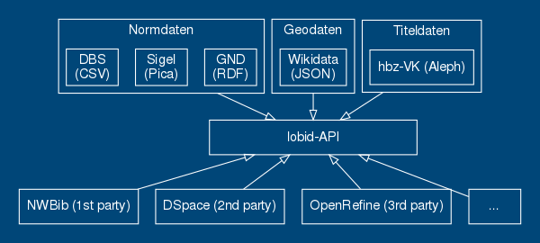
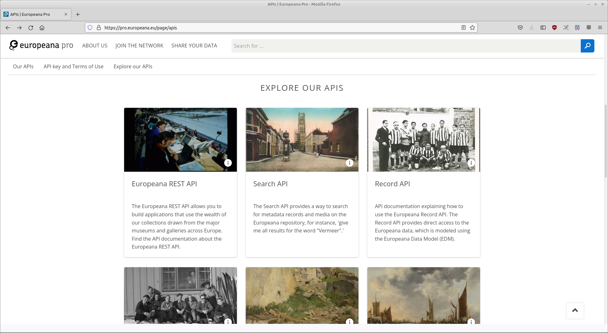

# MALIS21: Modul IT2  
Adrian Pohl
  
2. Präsenzphase, 2021-11-13

[PDF](https://malis21.acka47.net/slides/2021-11-13.pdf)

---

### Dokumentation & Fragen in HedgeDoc
-> **[https://pad.gwdg.de/malis21-it2.1](https://pad.gwdg.de/malis21-it2.1)**

---

### Bibliotheken sind Software

> Our collections and services are delivered primarily via software. [...] The choices we make in the development, selection, and implementation of this software [...] define the limits of our content and services. We can only be as good as our software.
— Cody Hanson, [Libraries are Software](http://codyhanson.com/writing/software.html)

---

# APIs

Application Programming Interface;

deutsch: Programmierschnittstellen

---

#### "ein Programmteil, der von einem Softwaresystem anderen Programmen zur Anbindung an das System zur Verfügung gestellt wird"
([Wikipedia](https://de.wikipedia.org/w/index.php?title=Programmierschnittstelle&oldid=215955723))

---

### APIs

* Software baut auf APIs auf
* APIs machen Softwareentwicklung handhabbar
* APIs ermöglichen Nutzung und Integration
* APIs entkoppeln Anwendungen von Datenquellen, Formaten und Systemen
* Sie ermöglichen modulare, zukunftsfähige Anwendungen

---

### Zum Beispiel lobid-Formate und -Anwendungen



---

## Und wie APIs im Web bereitstellen? 

* heutzutage meist JSON über HTTP
* De-facto Standard für Daten im Web, siehe z.B. Target, Sinclair (2017): The Rise and Rise of JSON, https://twobithistory.org/2017/09/21/the-rise-and-rise-of-json.html

---

### Anwendungsspezifisch oder standardisiert

* APIs können anwendungsspezifisch sein (vgl. [lobid](https://lobid.org))
* oder auf geteilten Standards beruhen (z.B. [IIIF](https://iiif.io/), [DAIA-API](https://verbundwiki.gbv.de/display/VZG/DAIA), [Reconciliation Service API](https://reconciliation-api.github.io/specs/latest/))
* Standardisierte APIs ermöglichen Nutzung von 3rd-Party-Software, z.B. [Mirador Viewer](https://projectmirador.org/), [OpenRefine für Datenabgleich](https://openrefine.org/)

---

bloße **Lese-APIs** (lassen sich gut mit Suchmaschinentechnologie umsetzen)

  vs.

vollständige **Unterstützung von CRUD**-Operationen: Create, Read, Update, Delete

---

### Rückblick: URIs

```
foo://example.com:8042/over/there?name=ferret#nose
\_/   \______________/\_________/ \_________/ \__/
 |           |            |            |        |
scheme    authority      path        query   fragment
 |   _____________________|__
/ \ /                        \
urn:example:animal:ferret:nose
```
---

### Basis von Web-APIs: URIs & HTTP

* Path: Welche API-Endpoints gibt es?
* Parameter: z.B. `q` oder `search` für Suchabfragen oder `from`/`page` und `size` für Paging und Anzahl der Suchergebnisse
* Bsp.: https://lobid.org/gnd/search?q=Köln&filter=type:PlaceOrGeographicName&size=50&from=100&format=html

---

### HTTP-Methoden & ihre Funktionen

- Create: POST (manchmal PUT)
- Read: GET
- Update: PUT (komplette Ressource), PATCH (teilweises Update), POST
- Delete: DELETE

---

## JSON

### JavaScript Object Notation

---

### JSON

* Ein einfaches Key-Value-Format für die Speicherung und den Austausch strukturierter Daten
* Key ist immer ein String
* Value ist String, Boolean (true/false), Number, Null, Array, Object
* `{ "key": "value" }`
* Quelle: [RFC 8259](https://tools.ietf.org/html/rfc8259)

---

### Ein JSON-Dokument

```json
{
   "degreeProgramme":"MALIS",
   "module":"IT2",
   "topics":[
      "LZV",
      "Web APIs",
      "Linked Open Data"
   ],
   "instructor":[
      {
         "id":8,
         "name":"Adrian Pohl",
         "affiliation":"hbz"
      },
      {
         "id":15,
         "name":"Claudia Piesche",
         "affiliation":"USB Köln"
      }
   ]
}
```

---

### Das gleiche Dokument

```json
{"degreeProgramme":"MALIS","module":"IT2","topics":["LZV","Web APIs","Linked Open Data"],"instructor":[{"id":8,"name":"Adrian Pohl","affiliation":"hbz"},{"id":15,"name":"Claudia Piesche","affiliation":"USB Köln"}]}
```
Einrückungen und Zeilenumbrüche sind nur zur besseren Lesbarkeit und werden beim Verarbeiten durch Maschinen weggekürzt.

---

### Übung: JSON-Fehler erkennen

---

### Fehler 1

```json
{
  "Hello":"World"
    
```

---

### Fehler 2

```json
{
  "degreeProgramme":"MALIS21"
  "module":"IT2"
}
```

---

### Fehler 3

```json
{
  "degreeProgramme": "MALIS21",
  "module: "IT2"
}
```

---

### Fehler 4

```json
{
  "degreeProgramme":"MALIS21",
  "module":"IT2",
  "instructor":[
    {
      "name":"Adrian Pohl",
      "affiliation":"hbz"
    },
    {
      "name":"Claudia Piesche",
      "affiliation":"USB Köln"
    ]
  }
}
```

---

### Übung: JSON schreiben

* Öffnen Sie den JSON Editor unter https://jsonformatter.org/json-editor
* Schreiben Sie ein JSON-Dokument, das einen String, ein Objekt und ein Array von Strings enthält
* Klicken Sie auf "Format JSON", um zu sehen, ob das JSON valide ist

---

### Website + API vs. Website = API

* Manchmal ist die API integraler Bestandteil einer Website, manchmal ist sie separat
* Leichtes Umschalten zwischen HTML und JSON kann sehr nützlich sein, sowohl für das Entwicklungsteam als auch für Nutzer\*innen
* Je nach Komplexität des Systems und den angebotenen Funktionen können separate APIs sinnvoll sein

---

### Beispiel 1: Open Textbook Library

siehe [Übung 1 vom letzten Mal](https://malis21.acka47.net/slides/2021-10-13.html#/60), wo Webseite und API identisch sind und wahlweise HTML oder JSON liefern

---

### Beispiel 2: lobid

https://lobid.org/resources/search?q=MALIS

vs.

`$ curl https://lobid.org/resources/search?q=MALIS`

oder

https://lobid.org/resources/search?q=MALIS&format=json

---

### Beispiel 3: Europeana

Quelle: [https://pro.europeana.eu/page/apis](https://pro.europeana.eu/page/apis)

---

### Beispiel 4: DDB
* Deutsche Digitale Bibliothek: https://labs.deutsche-digitale-bibliothek.de/app/ddbapi/

---

# Web-APIs: Nutzung

---

### API Keys

* Für viele APIs  ist eine Authentifizierung nötig
* Diese geschieht meist mit einem API Key
* Die API-Dokumentation sollte beschreiben, wie ein API Key bezogen werden kann

---

### API-Dokumentation

Für die Nutzung einer API ist die Dokumentation essentiell, um die Funktionalitäten der API und wie sie genutzt werden können kennenzulernen.

---

### [OpenAPI](https://www.openapis.org/)

* Standard für die API-Dokumentation
* JSON Schema-kompatibel, kann auch YAML
* Wie sehen valide Input- oder Output-Daten aus? Welche Pfade unterstützen welche [HTTP-Methoden](((615a1548-1998-41c0-b6fe-9e41393379b2)))? Welche Parameter werden unterstützt? Welche Struktur haben Daten, die an die API oder von ihr gesendet werden?
* Beispiele: [DDB](https://api.deutsche-digitale-bibliothek.de) oder [OERSI-API](https://gitlab.com/oersi/oersi-backend/-/blob/master/src/main/resources/model/api.yaml)
* OpenAPI unterstützt auch die Entwicklung, die Visualisierung und die direkte softwareseitige Nutzung einer API

---

### jq

* Programmiersprache und Kommandozeilentool
* https://stedolan.github.io/jq/
* jq-Spielplatz: https://jqplay.org/

---

### APIs nutzen mit curl & jq

* curl hat sich ja bereits als nützlich erwiesen, für HTTP Requests
* Die Kombination von curl und jq eignet sich gut, um APIs und die darüber angebotenen Daten zu erforschen
* Ermöglicht wird die Kombination der beiden Tools in der Kommandozeile durch "Pipes"

---

### Pipes | 

* Pipes (engl. "Rohrleitungen") leiten den Datenstrom eines Programms an ein anderes weiter
* `programm1 (...) | programm2 (...)`
* `$ curl <URL> | jq -...`
* [Unix-Philosphie](https://de.wikipedia.org/wiki/Unix-Philosophie): "Mache nur eine Sache und mache sie gut."
* curl ist die beste Software zum Übertragen von Daten in Rechnernetzen und jq ist das beliebteste Kommandozeilentool für die Verarbeitung von JSON

---

### Beispiele Open Textbook Library

* die Titel der ersten zehn Ressourcen: <small>`$ curl -H "accept: application/json" "https://open.umn.edu/opentextbooks/textbooks" | jq .data[].title`</small>
* die Subjects: <small>`$ curl -H "accept: application/json" "https://open.umn.edu/opentextbooks/textbooks" | jq .data[].subjects[].name`</small>

---

### Übung: Open Textbook API abfragen mit curl & jq

* **Frage**: Wie aktuell sind die Textbücher?
* **Aufgabe**:
  1. Finden Sie in der API Doku ([hier](https://open.umn.edu/opentextbooks/discovery) verlinkt) die URL für die Liste der neuesten Bücher heraus.
  2. Holen Sie mit curl die JSON-Daten und filtern Sie mit jq das Feld mit dem Copyright-Jahr.

---

### lobid-resources

<small>`$ curl "https://lobid.org/resources/search?q=MALIS+AND+Köln&size=50" | jq -r .member[].contribution[0].agent.label `</small>

-> Name der 1. beitragenden Person von Titeln mit  "MALIS" und "Köln"


---

### Sortierung und Zählung von Dubletten

* `$ ... | sort | uniq -c | sort -nr`
* `sort`: sortieren nach Alphabet
* `uniq -c`: entferne dublette Strings und zähle (`-c`, count) das Gesamtvorkommen
* `sort -nr`: nummerische Sortierung (`n`), umgedreht (`r`, reverse)

---

# JSON Schema

---

### JSON ist nur eine Datenstruktur

* die Verwendung von JSON als Datenformat legt nur die Syntax fest, ansonsten können mit JSON beliebige Informationen repräsentiert werden
*  Feldnamen und -inhalte sowie die hierarchische Schachtelung eines JSON-Dokuments können beliebig gewählt werden
* zur Beschreibung eines konkrete JSON-Datenmodells gibt es JSON Schema

---

### JSON Schema und seine Funktionen

* [https://json-schema.org/](https://json-schema.org/)
* Datenmodellierung
* Dokumentation
* Validierung von Instanzdaten
* Generierung von Webformularen

---

### Was definiert JSON Schema?

* Feldnamen
* Typen von Feldwerten (`string`, `array`, `object`, `number`, `boolean`, `null`)
* Pflichtfeld: ja/nein (`required`)
* Häufigkeit eines Feldes
* Formatierung eines Strings (z.B. `uri`, `date`; oder `pattern` plus Regular Expression)

---

### Ein Beispielschema

URL: https://malis21.acka47.net/assets/beispielschema.json

```json
{
  "$schema": "http://json-schema.org/draft-07/schema#",
  "$id": "https://malis21.acka47.net/data/beispielschema.json",
  "title": "Beispielressource",
  "description": "Dies ist ein generisches Schema zur Beschreibung einer Webressource mit schema.org",
  "type": "object",
  "properties": {
    "@context": {
      "type": "string",
      "const": "https://schema.org"
    },
    "id": {
      "title": "URL",
      "type": "string",
      "format": "uri"
    },
    "type": {
      "title": "Typ",
      "type": "string",
      "enum": [
        "3DModel",
        "AmpStory",
        "Article",
        "Atlas",
        "Audiobook",
        "AudioObject",
        "Blog",
        "Book",
        "BookSeries",
        "Chapter",
        "Clip",
        "Collection",
        "ComicStory",
        "Comment",
        "Conversation",
        "Course",
        "CreativeWorkSeason",
        "CreativeWorkSeries",
        "DataDownload",
        "Diet",
        "DigitalDocument",
        "Drawing",
        "Episode",
        "ExercisePlan",
        "FAQPage",
        "Game",
        "Guide",
        "HowTo",
        "ImageGallery",
        "ImageObject",
        "LearningResource",
        "LegislationObject",
        "Manuscript",
        "Map",
        "MathSolver",
        "MediaGallery",
        "MediaObject",
        "Message",
        "MobileApplication",
        "Movie",
        "MovieClip",
        "MovieSeries",
        "MusicAlbum",
        "MusicComposition",
        "MusicPlaylist",
        "MusicRecording",
        "MusicRelease",
        "MusicVideoObject",
        "NewsArticle",
        "Painting",
        "Periodical",
        "Photograph",
        "Play",
        "PodcastEpisode",
        "PodcastSeason",
        "PodcastSeries",
        "Poster",
        "PresentationDigitalDocument",
        "PublicationIssue",
        "PublicationVolume",
        "Quotation",
        "Quiz",
        "RadioClip",
        "RadioEpisode",
        "RadioSeason",
        "RadioSeries",
        "Recipe",
        "Review",
        "Report",
        "ScholarlyArticle",
        "Sculpture",
        "SheetMusic",
        "ShortStory",
        "SoftwareApplication",
        "SoftwareSourceCode",
        "SpreadsheetDigitalDocument",
        "TVClip",
        "TVEpisode",
        "TVSeason",
        "TVSeries",
        "Thesis",
        "TextDigitalDocument",
        "VideoGallery",
        "VideoGame",
        "VideoGameClip",
        "VideoGameSeries",
        "VideoObject",
        "VisualArtwork",
        "WebApplication",
        "WebContent",
        "WebPage"
      ]
    },
    "name": {
      "title": "Titel",
      "type": "string"
    },
    "creator": {
      "title": "Urheber",
      "type": "array",
      "items": {
        "type": "object",
        "properties": {
          "type": {
            "title": "Type",
            "type": "string",
            "enum": [
              "Person",
              "Organization"
            ]
          },
          "id": {
            "title": "URL",
            "type": "string",
            "format": "uri"
          },
          "name": {
            "title": "Name",
            "type": "string"
          }
        },
        "required": [
          "name",
          "type"
        ]
      }
    },
    "description": {
      "title": "Beschreibung",
      "type": "string"
    },
    "about": {
      "title": "Schlagwort",
      "type": "array",
      "items": {
        "type": "object",
        "properties": {
          "type": {
            "type": "string",
            "format": "uri",
            "enum": [
              "https://d-nb.info/standards/elementset/gnd#AuthorityResource"
            ]
          },
          "id": {
            "title": "URI",
            "type": "string",
            "format": "uri",
            "pattern": "^https:\/\/d-nb.info\/gnd\/.*"
          },
          "name": {
            "title": "The preferred label of the subject",
            "type": "string"
          }
        },
        "required": [
          "id"
        ]
      }
    },
    "license": {
      "title": "Lizenz",
      "type": "string",
      "format": "uri",
      "pattern": "^https:\/\/creativecommons.org\/(licenses|licences|publicdomain)\/.*"
    },
    "image": {
      "title": "Bild",
      "type": "string",
      "format": "uri"
    },
    "datePublished": {
      "title": "Publikationsdatum",
      "type": "string",
      "format": "date"
    },
    "inLanguage": {
      "title": "Sprache",
      "type": "string",
      "enum": [
        "en",
        "de",
        "fr",
        "es",
        "tr",
        "ar",
        "ru",
        "zh"
      ]
    },
    "publisher": {
      "title": "Publisher",
      "type": "object",
      "properties": {
        "type": {
          "title": "Type",
          "type": "string",
          "enum": [
            "Organization"
          ]
        },
        "id": {
          "title": "URL",
          "type": "string",
          "format": "uri"
        },
        "name": {
          "title": "Name",
          "type": "string"
        }
      },
      "required": [
        "name",
        "type"
      ]
    },
    "isBasedOn": {
      "title": "Basiert auf",
      "type": "array",
      "items": {
        "type": "string",
        "format": "uri"
      }
    }
  },
  "required": [
    "@context",
    "id",
    "name"
  ]
}
```
---

### Beginnen wir am Anfang

```json
{
  "$schema":"http://json-schema.org/draft-07/schema#",
  "$id": "https://malis21.acka47.net/data/beispielschema.json",
  "title":"Beispielressource",
  "description":"Dies ist ein generisches Schema zur Beschreibung einer Webressource mit schema.org",
  "type":"object",
  "properties":{
    ...
  }
}
```

---

### Beschreibung des Wurzelschemas

* Angabe der JSON-Schema-Version mit `"$schema"`
* Angabe der `$id` (muss nicht notwendigerweise eine URL sein)
* Titel und Beschreibung des Schemas: `title`, `description`
* Jedes JSON-Dokument ist ein Objekt (`{ "key": "value" }`), deshalb `"type": "object"`
* Auflistung der genutzten Feldnamen mit `properties`

---

### Feld mit nicht spezifiziertem String

```json
  "name": {
    "title": "Titel",
    "type": "string"
  }
```

---

### Feld mit URI-formatiertem String

```json
    "id": {
      "title": "URL",
      "type": "string",
      "format": "uri"
    }
```

---

### Aufzählung möglicher Strings

```json
  "type": {
    "title": "Type",
    "type": "string",
    "enum": [
      "3DModel",
      "AmpStory",
      "Article",
      ...
    ]
  }
```

---

### Objekt als Wert

```json
  "publisher": {
        "title": "Publisher",
        "type": "object",
        "properties": {
          ...
        }
      }
```

---

### Array als Wert
```json
  "creator": {
      "title": "Urheber",
      "type": "array",
      "items": {
        "type": "object",
        "properties": {
          ...
        }
      }
  }
```

---

### Lust auf mehr JSON Schema?

-> [Aufgabe 2.1](https://codeberg.org/acka47/malis21-aufgabe1.1)

### Zu technisch?

-> [Aufgabe 2.2](https://pad.gwdg.de/s/malis21-aufgabe1.2)

Flowchart: https://pad.gwdg.de/malis21-it2-aufgaben1